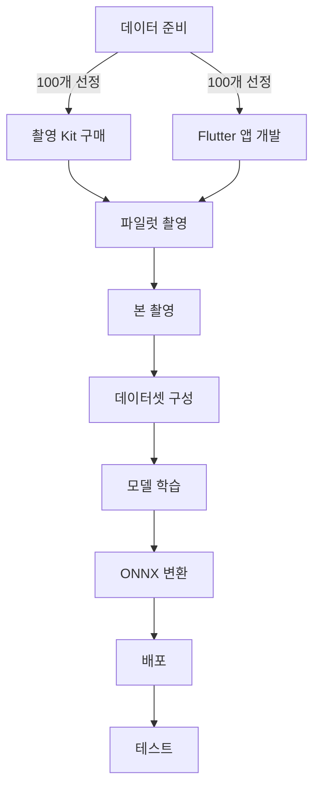

# 🎯 PillSnap Narrow Model Project

<div align="center">


**"4,523개를 70% 정확도로 하는 것보다, 100개를 95% 정확도로"**

</div>

## 📊 Project Dashboard

| Phase | Status | Progress | Tasks | Key Deliverable |
|-------|--------|----------|-------|-----------------|
| **[Phase 1: Data Prep](./planning/phase1_data_prep.md)** | ✅ Complete |  | 7/7 | `top_100_metadata_final.json` |
| **[Phase 2: Collection Setup](./planning/phase2_collection.md)** | 🏗️ In Progress |  | 3/16 | Flutter App + Supabase |
| **[Phase 3: Photo Collection](./planning/phase3_photo_collection.md)** | 🔜 Not Started |  | 0/8 | 24,000 photos |
| **[Phase 4: Model Training](./planning/phase4_training.md)** | 🔜 Not Started |  | 0/14 | `model.onnx` |
| **[Phase 5: Deployment](./planning/phase5_deployment.md)** | 🔜 Not Started |  | 0/12 | Production API |

## 🎯 Project Goal

한국 약국에서 가장 많이 사용되는 **100개 약품**에 집중하여 **95% 이상의 정확도**를 달성하는 실용적인 AI 모델 구축

## 📌 Current Status

### ✅ Completed Today (2025-10-23)

```
[x] 100개 약품 최종 선정 완료 - top_100_metadata_final.json
[x] Supabase 스키마 설계 및 적용 - capture_drugs_master, capture_real_photos
[x] 100개 약품 데이터 Supabase 로드
[x] 실제 촬영 전략 수립 - 240장/약품, 총 24,000장
[x] 5가지 배경 정의 - 손바닥, 나무, 흰색, 검은색, 패턴
[x] 촬영 프로토콜 문서 작성 - 파일명 컨벤션, 품질 검증 기준
[x] 기존 데이터셋 구조 분석 - 파일명 형식 매핑 완료
```

### 🎯 Next Steps

```
[ ] Flutter 앱 개발 시작 (카메라, 품질 검증, Supabase 연동)
[ ] 촬영 장비 구매 - LED 스튜디오 박스, 회전판, 배경 재료
[ ] 파일럿 촬영 테스트 (1개 약품 × 240장)
[ ] 촬영 프로토콜 검증 및 개선
```

## 📋 Master TODO List (57 Tasks)

<details>
<summary><b>Phase 1: 데이터 준비 [7/7] ✅ COMPLETE</b> (클릭하여 펼치기)</summary>

- [x] K-CODE와 EDI 매핑 테이블 구축 - kcode_label_map.json과 drugs_master.csv 연결
- [x] 약국 사용량 CSV 파일 로드 및 EDI별 사용 빈도 계산
- [x] 현재 데이터셋 4,523개 K-CODE 중 EDI 매핑된 항목 필터링
- [x] 사용량 기준 상위 200개 약품 추출 및 Excel 생성
- [x] Excel 파일 검토 - shootable 기준 (Y=92개, M=8개) 분류
- [x] 수동 검토 - 제외 약품 마킹 및 최종 100개 선정
- [x] 최종 100개 약품 메타데이터 JSON 생성 (K-CODE, EDI, 약품명, 촬영난이도)

**산출물:**
- `artifacts/top_100_metadata_final.json` - 100개 약품 메타데이터
- `scripts/capture_checklist.csv` - 촬영 진행 체크리스트

</details>

<details>
<summary><b>Phase 2: 수집 시스템 구축 [3/16]</b> (클릭하여 펼치기)</summary>

### 촬영 환경 준비 [0/5]
- [ ] LED 스튜디오 박스 200mm 구매 (96 LED, CRI 97+)
- [ ] 360도 회전판 구매 (13.8cm 직경, 4 RPM)
- [ ] 배경 재료 5종 준비 (손바닥 사진, 나무판, 흰/검은 종이, 패턴 천)
- [ ] Galaxy S21 수직 고정 삼각대 설치
- [ ] 촬영 환경 테스트 - 조명/각도/품질 확인

### Flutter 앱 개발 [0/7]
- [ ] Flutter 프로젝트 생성 - pillsnap_capture
- [ ] Camera2 API 통합 - ISO 100, 셔터 1/100s, 4000×3000
- [ ] 회전 타이밍 자동화 - 4 RPM 기준 각도별 촬영 시퀀스
- [ ] 품질 검증 구현 - 선명도, 노출, 중앙정렬, 반사광 (A/B/C 등급)
- [ ] 약품 선택 UI - 100개 목록, 진행 상황 표시
- [ ] Supabase 연동 - 인증, Storage 업로드, 메타데이터 저장
- [ ] APK 빌드 및 Galaxy S21 설치

### Supabase 설정 [3/4]
- [x] Supabase 스키마 설계 - capture_drugs_master, capture_real_photos, capture_sessions
- [x] 100개 약품 데이터 로드 - capture_drugs_master 테이블
- [x] 5가지 배경 색상 정의 - capture_background_colors 테이블
- [ ] Storage bucket 생성 및 RLS 정책 설정

**산출물:**
- `scripts/setup_supabase_final.sql` - Supabase 스키마
- `scripts/load_drugs_to_supabase.py` - 약품 데이터 로드 스크립트
- `docs/capture_protocol.md` - 촬영 프로토콜 문서

</details>

<details>
<summary><b>Phase 3: 데이터 수집 [0/8]</b> (클릭하여 펼치기)</summary>

### 파일럿 테스트 [0/4]
- [ ] 1개 약품 실물 확보 (테스트용)
- [ ] 240장 촬영 테스트 (5배경 × 3조명 × 8회전 × 2면)
- [ ] 품질 검증 및 프로토콜 개선
- [ ] 소요 시간 측정 및 일정 재조정

### 본 촬영 [0/4]
- [ ] 100개 약품 실물 확보 (약국 협조/온라인 구매)
- [ ] 일일 6개 약품씩 16일간 촬영 - 총 24,000장
- [ ] 품질 A/B등급 90% 이상 확보 검증
- [ ] Supabase 업로드 및 진행 상황 모니터링

**촬영 전략:**
- 배경: 5종 (손바닥, 나무, 흰색, 검은색, 패턴)
- 조명: 3단계 (LED 3, 5, 8)
- 회전각: 8개 (45도 간격)
- 예상 소요: 80분/약품, 총 130시간

</details>

<details>
<summary><b>Phase 4: 모델 학습 [0/14]</b> (클릭하여 펼치기)</summary>

### 전처리 표준화 [0/4]
- [ ] UnifiedPreprocessor 클래스 구현 - 512x512, CLAHE, 정규화
- [ ] Flutter 이미지 전처리 - 중앙크롭, 리사이즈, JPEG 압축
- [ ] BFF 검증 로직 - 크기/포맷 확인, 변환 없음
- [ ] 추론서버 통합 - UnifiedPreprocessor 적용

### 데이터셋 구성 [0/5]
- [ ] 100개 클래스 인덱스 매핑 (0-99) 생성
- [ ] 기존 스튜디오 이미지 심볼릭 링크 생성
- [ ] 실사진 통합 - 스튜디오:실사진 = 3:7 비율
- [ ] Train/Val/Test 분할 - 80:10:10
- [ ] Manifest JSON 파일 생성

### 모델 학습 [0/5]
- [ ] pillsnap_narrow 프로젝트 디렉토리 구조 생성
- [ ] EfficientNetV2-S 백본 준비 - 기존 가중치 로드
- [ ] Baseline 학습 - 10 epochs, 초기 성능 측정
- [ ] 하이퍼파라미터 튜닝 - LR, Weight Decay, Augmentation
- [ ] 최종 학습 - 50 epochs, Best checkpoint 저장

</details>

<details>
<summary><b>Phase 5: 배포 및 테스트 [0/12]</b> (클릭하여 펼치기)</summary>

### 모델 배포 [0/4]
- [ ] PyTorch to ONNX 변환 - 최적화 및 양자화
- [ ] 추론서버 통합 - 100개 클래스 전용 엔드포인트
- [ ] 성능 벤치마크 - 추론속도 50ms 이하 확인
- [ ] Docker 이미지 빌드 및 배포

### 테스트 [0/4]
- [ ] 단위 테스트 - 전처리, 모델, API
- [ ] 통합 테스트 - End-to-End 파이프라인
- [ ] 실사진 정확도 테스트 - 80% 이상 달성 확인
- [ ] 약국 현장 테스트 - 실제 환경 검증

### 성능 검증 [0/4]
- [ ] Top-1 정확도 85% 이상 달성
- [ ] Top-5 정확도 95% 이상 달성
- [ ] 추론 속도 50ms 이하 (P95)
- [ ] 메모리 사용량 최적화

</details>

## 📈 Key Performance Indicators

| Category | Metric | Current | Target | Status |
|----------|--------|---------|--------|--------|
| **Coverage** | 약품 선정 | 100 최종 | 100 | ✅ |
| **Data** | Supabase 로드 | 100 | 100 | ✅ |
| **Data** | 실사진 수집 | 0 | 24,000 | 🔴 |
| **Quality** | A등급 비율 | - | >85% | ⏳ |
| **Model** | Top-1 정확도 | - | >85% | ⏳ |
| **Speed** | 추론 시간 | - | <50ms | ⏳ |

## 🚀 Quick Start

```bash
# Clone repository
git clone https://github.com/helious23/pillsnap-narrow-model.git
cd pillsnap-narrow-model

# Setup environment
python3.11 -m venv .venv
source .venv/bin/activate
pip install pandas openpyxl

# Run data preparation
python scripts/data_prep/prepare_drug_selection.py

# Check generated files
ls -la artifacts/
```

## 📁 Project Structure

```
pillsnap-narrow-model/
├── 📁 docs/               # 프로젝트 문서
│   ├── 01_overview.md    # 프로젝트 개요
│   ├── 02_technical.md   # 기술 명세
│   └── 03_risks.md       # 리스크 관리
├── 📁 planning/           # 단계별 상세 계획
│   ├── phase1_data_prep.md
│   ├── phase2_collection.md
│   ├── phase3_photo_collection.md
│   ├── phase4_training.md
│   └── phase5_deployment.md
├── 📁 progress/           # 진행 보고서
│   ├── daily_log.md
│   └── weekly_report.md
├── 📁 artifacts/          # 산출물
│   ├── datasets/         # 데이터셋
│   ├── models/          # 학습된 모델
│   └── configs/         # 설정 파일
└── 📁 scripts/           # 실행 스크립트
    ├── setup/           # 환경 설정
    ├── data_prep/       # 데이터 준비
    └── training/        # 모델 학습
```

## 🔄 Dependencies & Critical Path



## 📝 Recent Commits

| Date | Commit | Description | Author |
|------|--------|-------------|--------|
| 2025-10-23 | `0959fdc` | feat: 실제 촬영 시스템 Supabase 스키마 및 프로토콜 추가 | @helious23 |
| 2025-10-22 | `bd5a4fb` | feat: 약품 선정을 위한 데이터 추출 스크립트 구현 | @helious23 |
| 2025-10-22 | `51ccef1` | docs: Phase별 상세 계획 문서 추가 | @helious23 |
| 2025-10-22 | `initial` | 🎉 프로젝트 시작 및 구조 설정 | @helious23 |

## 🏆 Milestones

- [x] **Milestone 1**: 100개 약품 선정 완료 (2025-10-23)
- [ ] **Milestone 2**: 촬영 시스템 구축 완료 (Supabase 3/4, Flutter 0/7)
- [ ] **Milestone 3**: 24,000장 사진 수집 완료
- [ ] **Milestone 4**: 모델 학습 완료 (Head Fine-tuning)
- [ ] **Milestone 5**: 프로덕션 배포

## 👥 Contributors

- **@helious23** - Project Lead

## 🔗 관련 저장소

- **메인 프로젝트**: https://github.com/helious23/pillsnap-narrow-model
- **추론 서버**: https://github.com/helious23/pillsnap-inference-narrow
- **로컬 경로**:
  - 학습/데이터: `/home/max16/pillsnap-narrow-model/`
  - 추론 서버: `/home/max16/pillsnap_inference_narrow/`

## 📄 License

This project is proprietary and confidential.

---

<div align="center">

**[📋 View Full Task Board](./planning/README.md)** | **[📊 Progress Report](./progress/daily_log.md)** | **[📸 Capture Protocol](./docs/capture_protocol.md)**

*Last Updated: 2025-10-23 20:15 KST*

</div>