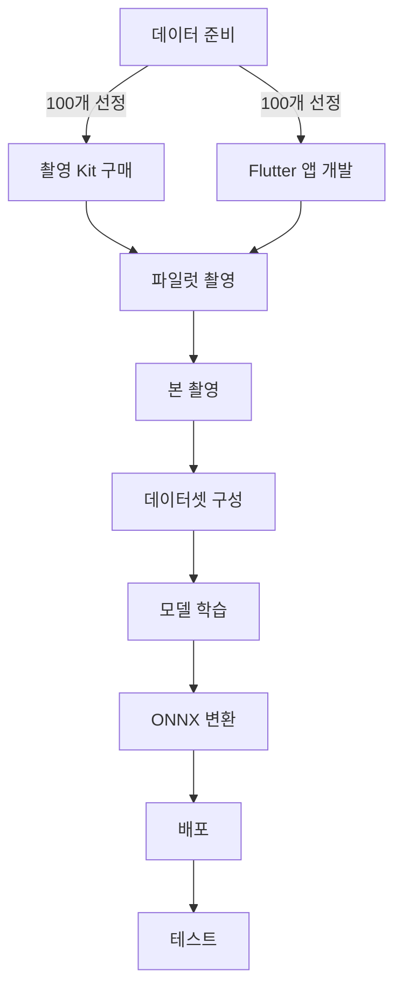

# 🎯 PillSnap Narrow Model Project

<div align="center">


**"4,523개를 70% 정확도로 하는 것보다, 100개를 95% 정확도로"**

</div>

## 📊 Project Dashboard

| Phase | Status | Progress | Tasks | Target | Key Deliverable |
|-------|--------|----------|-------|--------|-----------------|
| **[Phase 1: Data Prep](./planning/phase1_data_prep.md)** | 🏗️ In Progress |  | 0/7 | Week 1 | `top_100_drugs.csv` |
| **[Phase 2: Collection Setup](./planning/phase2_collection.md)** | ⏳ Pending |  | 0/16 | Week 1 | Flutter App + Kit |
| **[Phase 3: Photo Collection](./planning/phase3_photo_collection.md)** | 🔜 Not Started |  | 0/8 | Week 2 | 1,000+ photos |
| **[Phase 4: Model Training](./planning/phase4_training.md)** | 🔜 Not Started |  | 0/14 | Week 2-3 | `model.onnx` |
| **[Phase 5: Deployment](./planning/phase5_deployment.md)** | 🔜 Not Started |  | 0/12 | Week 3 | Production API |

## 🎯 Project Goal

한국 약국에서 가장 많이 사용되는 **100개 약품**에 집중하여 **95% 이상의 정확도**를 달성하는 실용적인 AI 모델 구축

## 📌 Current Focus (2024-10-22)

### 🔥 Immediate Tasks (Today)

```
[ ] K-CODE와 EDI 매핑 테이블 구축
[ ] 약국 사용량 데이터 분석 시작
[ ] GitHub 프로젝트 문서 구조 완성
```

### 📅 This Week's Milestones

| Day | Focus Area | Key Deliverables |
|-----|------------|------------------|
| **화 (10/22)** | 데이터 분석 시작 | K-CODE/EDI 매핑 |
| **수 (10/23)** | 약품 선정 | Top 200 리스트 |
| **목 (10/24)** | 촬영 Kit 구매 | 장비 확보 |
| **금 (10/25)** | Flutter 앱 개발 | 기본 UI 완성 |
| **토 (10/26)** | 파일럿 테스트 | 30개 약품 촬영 |
| **일 (10/27)** | 데이터 검증 | QC 시스템 구축 |

## 📋 Master TODO List (57 Tasks)

<details>
<summary><b>Phase 1: 데이터 준비 [0/7]</b> (클릭하여 펼치기)</summary>

- [ ] K-CODE와 EDI 매핑 테이블 구축 - kcode_label_map.json과 drugs_master.csv 연결
- [ ] 약국 사용량 CSV 파일 로드 및 EDI별 사용 빈도 계산
- [ ] 현재 데이터셋 4,523개 K-CODE 중 EDI 매핑된 항목 필터링
- [ ] 사용량 기준 상위 200개 약품 추출 및 CSV 생성
- [ ] Excel 파일 생성 - PTP/연질캡슐/소형약품 표시 컬럼 추가
- [ ] 수동 검토 - 제외 약품 마킹 및 최종 100개 선정
- [ ] 최종 100개 약품 메타데이터 JSON 생성 (K-CODE, EDI, 약품명, 외형정보)

</details>

<details>
<summary><b>Phase 2: 수집 시스템 구축 [0/16]</b> (클릭하여 펼치기)</summary>

### 촬영 환경 준비 [0/5]
- [ ] LED 링라이트 6인치 + 삼각대 구매 (25,000원)
- [ ] 유니버설 스마트폰 거치대 구매 (15,000원)
- [ ] A3 백색 무광 폼보드 5장 + 투명 눈금자 구매
- [ ] Galaxy S21 Pro Mode 설정 - ISO 100, 1/60s, WB 5000K, Manual Focus
- [ ] DIY 촬영 부스 조립 - 15cm 거리 마킹, L자 배경 설치

### Flutter 앱 개발 [0/7]
- [ ] Flutter 프로젝트 생성 - pill_snap_collector
- [ ] 카메라 패키지 통합 및 권한 설정 (camera, permission_handler)
- [ ] 촬영 가이드 UI - 중앙 정렬 박스, 3x3 그리드, 거리 표시기
- [ ] 실시간 품질 체크 - 블러(Laplacian), 노출, 중앙정렬 검증
- [ ] 약품 정보 입력 폼 - K-CODE 검색, 수동 입력, 자동완성
- [ ] Supabase 연동 - 인증, Storage 업로드, 메타데이터 저장
- [ ] APK 빌드 및 Galaxy S21 설치

### Supabase 설정 [0/4]
- [ ] Supabase 프로젝트 생성 및 환경변수 설정
- [ ] Storage bucket 생성 - pill-images, 폴더구조 설계
- [ ] 테이블 스키마 생성 - real_photo_metadata, kcode_statistics
- [ ] RLS(Row Level Security) 정책 설정

</details>

<details>
<summary><b>Phase 3: 데이터 수집 [0/8]</b> (클릭하여 펼치기)</summary>

### 파일럿 테스트 [0/4]
- [ ] 상위 30개 약품 실물 확보 (약국 방문/온라인 구매)
- [ ] 30개 약품 x 10장 = 300장 촬영 (앞/뒤/옆)
- [ ] QC 검증 - A/B/C 등급 분류, 재촬영 리스트
- [ ] 촬영 프로토콜 개선 - 문제점 분석 및 가이드 수정

### 본 촬영 [0/4]
- [ ] 100개 약품 확보 계획 수립 (일정, 예산, 구매처)
- [ ] 일일 20개씩 5일간 촬영 - 총 1,000장 이상
- [ ] 품질 A등급 70% 이상 확보 검증
- [ ] Supabase 업로드 및 메타데이터 정리

</details>

<details>
<summary><b>Phase 4: 모델 학습 [0/14]</b> (클릭하여 펼치기)</summary>

### 전처리 표준화 [0/4]
- [ ] UnifiedPreprocessor 클래스 구현 - 512x512, CLAHE, 정규화
- [ ] Flutter 이미지 전처리 - 중앙크롭, 리사이즈, JPEG 압축
- [ ] BFF 검증 로직 - 크기/포맷 확인, 변환 없음
- [ ] 추론서버 통합 - UnifiedPreprocessor 적용

### 데이터셋 구성 [0/5]
- [ ] 100개 클래스 인덱스 매핑 (0-99) 생성
- [ ] 기존 스튜디오 이미지 심볼릭 링크 생성
- [ ] 실사진 통합 - 스튜디오:실사진 = 3:7 비율
- [ ] Train/Val/Test 분할 - 80:10:10
- [ ] Manifest JSON 파일 생성

### 모델 학습 [0/5]
- [ ] pillsnap_narrow 프로젝트 디렉토리 구조 생성
- [ ] EfficientNetV2-S 백본 준비 - 기존 가중치 로드
- [ ] Baseline 학습 - 10 epochs, 초기 성능 측정
- [ ] 하이퍼파라미터 튜닝 - LR, Weight Decay, Augmentation
- [ ] 최종 학습 - 50 epochs, Best checkpoint 저장

</details>

<details>
<summary><b>Phase 5: 배포 및 테스트 [0/12]</b> (클릭하여 펼치기)</summary>

### 모델 배포 [0/4]
- [ ] PyTorch to ONNX 변환 - 최적화 및 양자화
- [ ] 추론서버 통합 - 100개 클래스 전용 엔드포인트
- [ ] 성능 벤치마크 - 추론속도 50ms 이하 확인
- [ ] Docker 이미지 빌드 및 배포

### 테스트 [0/4]
- [ ] 단위 테스트 - 전처리, 모델, API
- [ ] 통합 테스트 - End-to-End 파이프라인
- [ ] 실사진 정확도 테스트 - 80% 이상 달성 확인
- [ ] 약국 현장 테스트 - 실제 환경 검증

### 성능 검증 [0/4]
- [ ] Top-1 정확도 85% 이상 달성
- [ ] Top-5 정확도 95% 이상 달성
- [ ] 추론 속도 50ms 이하 (P95)
- [ ] 메모리 사용량 최적화

</details>

## 📈 Key Performance Indicators

| Category | Metric | Current | Target | Status |
|----------|--------|---------|--------|--------|
| **Coverage** | 약품 선정 | 0/100 | 100 | 🔴 |
| **Data** | 실사진 수집 | 0 | 1,000+ | 🔴 |
| **Quality** | A등급 비율 | - | >70% | ⏳ |
| **Model** | Top-1 정확도 | - | >85% | ⏳ |
| **Speed** | 추론 시간 | - | <50ms | ⏳ |

## 🚀 Quick Start

```bash
# Clone repository
git clone https://github.com/helious23/pillsnap-narrow-model.git
cd pillsnap-narrow-model

# View current tasks
cat planning/current_sprint.md

# Check progress
python scripts/calculate_progress.py

# Run data preparation
python scripts/data_prep/select_top_drugs.py
```

## 📁 Project Structure

```
pillsnap-narrow-model/
├── 📁 docs/               # 프로젝트 문서
│   ├── 01_overview.md    # 프로젝트 개요
│   ├── 02_technical.md   # 기술 명세
│   └── 03_risks.md       # 리스크 관리
├── 📁 planning/           # 단계별 상세 계획
│   ├── phase1_data_prep.md
│   ├── phase2_collection.md
│   ├── phase3_photo_collection.md
│   ├── phase4_training.md
│   └── phase5_deployment.md
├── 📁 progress/           # 진행 보고서
│   ├── daily_log.md
│   └── weekly_report.md
├── 📁 artifacts/          # 산출물
│   ├── datasets/         # 데이터셋
│   ├── models/          # 학습된 모델
│   └── configs/         # 설정 파일
└── 📁 scripts/           # 실행 스크립트
    ├── setup/           # 환경 설정
    ├── data_prep/       # 데이터 준비
    └── training/        # 모델 학습
```

## 🔄 Dependencies & Critical Path



## 📝 Recent Commits

| Date | Commit | Description | Author |
|------|--------|-------------|--------|
| 2024-10-22 | `initial` | 🎉 프로젝트 시작 및 구조 설정 | @helious23 |

## 🏆 Milestones

- [ ] **Milestone 1**: 100개 약품 선정 완료 (Week 1)
- [ ] **Milestone 2**: 촬영 시스템 구축 완료 (Week 1)
- [ ] **Milestone 3**: 1,000장 사진 수집 완료 (Week 2)
- [ ] **Milestone 4**: 모델 학습 완료 (Week 2-3)
- [ ] **Milestone 5**: 프로덕션 배포 (Week 3)

## 👥 Contributors

- **@helious23** - Project Lead

## 📄 License

This project is proprietary and confidential.

---

<div align="center">

**[📋 View Full Task Board](./planning/README.md)** | **[📊 Progress Report](./progress/daily_log.md)**

*Last Updated: 2024-10-22 17:30 KST*

</div>