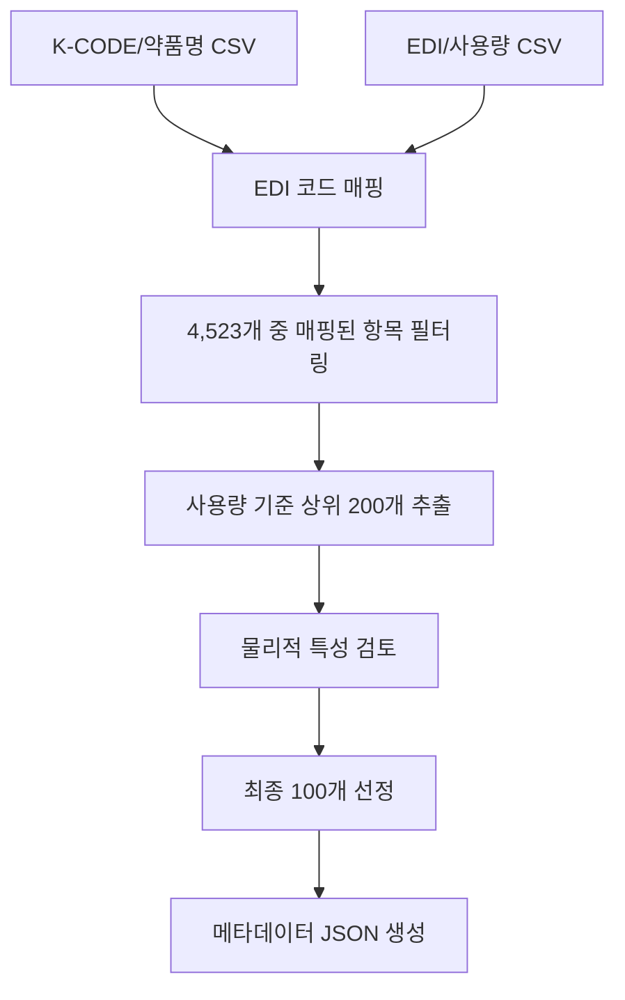

# 📊 Phase 1: 데이터 준비 상세 계획

## 🎯 목표
한국 약국에서 가장 많이 사용되는 **상위 100개 약품**을 과학적으로 선정하여 집중 학습 대상 확정

## 📅 일정: 2024-10-22 ~ 2024-10-23 (2일)

## 🔄 워크플로우



## 📋 상세 작업

### Task 1: K-CODE와 EDI 매핑 테이블 구축

**목적**: 현재 보유한 4,523개 K-CODE와 약국 사용량 데이터의 EDI 코드 연결

**입력 파일**:
- `/home/max16/pillsnap_data/kcode_label_map.json` - K-CODE와 약품명 매핑
- `/home/max16/pillsnap_bff/data/drugs_master.csv` - K-CODE, EDI, 약품명 포함
- `약국_사용량_데이터.csv` - EDI 코드별 사용량 (사용자 제공 필요)

**구현 스크립트**: `scripts/data_prep/build_kcode_edi_mapping.py`
```python
import json
import pandas as pd
from pathlib import Path

def build_mapping():
    # 1. K-CODE 라벨 맵 로드
    with open('/home/max16/pillsnap_data/kcode_label_map.json', 'r') as f:
        kcode_map = json.load(f)

    # 2. drugs_master.csv 로드
    drugs_df = pd.read_csv('/home/max16/pillsnap_bff/data/drugs_master.csv')

    # 3. K-CODE와 EDI 매핑 테이블 생성
    mapping = {}
    for kcode, drug_name in kcode_map.items():
        # drugs_master에서 K-CODE로 EDI 찾기
        match = drugs_df[drugs_df['K-CODE'] == kcode]
        if not match.empty:
            mapping[kcode] = {
                'drug_name': drug_name,
                'edi_code': match.iloc[0]['EDI_CODE'],
                'manufacturer': match.iloc[0].get('MANUFACTURER', '')
            }

    # 4. 매핑 결과 저장
    output_path = 'artifacts/datasets/kcode_edi_mapping.json'
    with open(output_path, 'w', encoding='utf-8') as f:
        json.dump(mapping, f, ensure_ascii=False, indent=2)

    print(f"✓ 매핑 완료: {len(mapping)}개 K-CODE")
    return mapping
```

**출력**: `artifacts/datasets/kcode_edi_mapping.json`

---

### Task 2: 약국 사용량 CSV 파일 로드 및 EDI별 사용 빈도 계산

**목적**: EDI 코드별 실제 약국 사용량 집계

**구현 로직**:
```python
def calculate_usage_frequency(usage_csv_path):
    # 약국 사용량 데이터 로드
    usage_df = pd.read_csv(usage_csv_path)

    # EDI별 사용량 집계
    usage_by_edi = usage_df.groupby('EDI_CODE').agg({
        'usage_count': 'sum',
        'prescription_count': 'sum',
        'pharmacy_count': 'nunique'
    }).sort_values('usage_count', ascending=False)

    return usage_by_edi
```

**메트릭**:
- `usage_count`: 총 사용량 (정/캡슐 단위)
- `prescription_count`: 처방 건수
- `pharmacy_count`: 사용 약국 수

---

### Task 3: 현재 데이터셋 4,523개 K-CODE 중 EDI 매핑된 항목 필터링

**목적**: 실제 사용 데이터가 있는 약품만 필터링

**필터링 기준**:
1. EDI 코드가 존재하는 K-CODE
2. 약국 사용량 데이터에 존재하는 EDI
3. 이미지 데이터가 충분한 K-CODE (최소 100장)

**검증 스크립트**:
```python
def filter_available_kcodes(mapping, usage_df):
    # EDI가 있는 K-CODE만 필터
    available_kcodes = []

    for kcode, info in mapping.items():
        edi = info.get('edi_code')

        # 사용량 데이터에 EDI 존재 확인
        if edi in usage_df.index:
            # 이미지 개수 확인
            img_count = count_images_for_kcode(kcode)
            if img_count >= 100:
                available_kcodes.append({
                    'kcode': kcode,
                    'edi': edi,
                    'drug_name': info['drug_name'],
                    'usage': usage_df.loc[edi]['usage_count'],
                    'image_count': img_count
                })

    return pd.DataFrame(available_kcodes)
```

---

### Task 4: 사용량 기준 상위 200개 약품 추출 및 CSV 생성

**목적**: 과다 선정 후 수동 검토를 위한 후보군 생성

**선정 기준 (가중치)**:
1. 약국 사용량 (40%)
2. 처방 빈도 (30%)
3. 약국 보급률 (20%)
4. 이미지 품질 (10%)

**스코어 계산**:
```python
def calculate_drug_score(row):
    # 정규화된 점수 계산
    usage_score = row['usage_rank'] / max_rank * 0.4
    prescription_score = row['prescription_rank'] / max_rank * 0.3
    pharmacy_score = row['pharmacy_coverage'] * 0.2
    image_score = min(row['image_count'] / 500, 1.0) * 0.1

    return usage_score + prescription_score + pharmacy_score + image_score
```

**출력**: `artifacts/datasets/top_200_candidates.csv`

---

### Task 5: Excel 파일 생성 - PTP/연질캡슐/소형약품 표시

**목적**: 촬영 난이도 및 제외 대상 판단을 위한 수동 검토 자료

**Excel 컬럼 구조**:
| K-CODE | EDI | 약품명 | 사용량 | 순위 | 제형 | PTP여부 | 연질캡슐 | 크기 | 촬영난이도 | 제외여부 | 비고 |
|--------|-----|--------|--------|------|------|---------|----------|------|------------|----------|------|
| K001234 | 12345678 | 타이레놀500mg | 1,234,567 | 1 | 정제 | N | N | 12mm | 하 | N | |
| K002345 | 23456789 | 게보린 | 987,654 | 2 | 캡슐 | Y | Y | 18mm | 상 | ? | PTP 포장 |

**촬영 난이도 기준**:
- **하**: 일반 정제, 10mm 이상, 단색
- **중**: 캡슐, 다색, 특수 코팅
- **상**: PTP 포장, 연질캡슐, 7mm 이하 소형

**자동 플래깅**:
```python
def auto_flag_exclusion(row):
    # 제외 권장 조건
    if row['size_mm'] < 5:  # 너무 작음
        return 'Y', '소형약품'
    if row['is_ptp'] and row['ptp_only']:  # PTP만 유통
        return 'Y', 'PTP 전용'
    if row['is_liquid_cap']:  # 연질캡슐
        return 'M', '촬영 어려움'
    return 'N', ''
```

---

### Task 6: 수동 검토 - 제외 약품 마킹 및 최종 100개 선정

**검토 기준**:

**✅ 우선 선정 대상**:
- 사용량 상위 50위 이내
- 일반 정제/캡슐 형태
- 10-20mm 크기
- 명확한 각인/색상

**⚠️ 검토 필요**:
- PTP 포장이지만 낱알 유통 가능
- 연질캡슐이지만 형태 유지 양호
- 소형이지만 고빈도 사용

**❌ 제외 대상**:
- 5mm 이하 극소형
- PTP 전용 포장 (낱알 불가)
- 액상/시럽류
- 주사제/외용제

**선정 프로세스**:
1. 상위 200개 엑셀 파일 검토
2. 제외 약품 'Y' 마킹
3. 대체 가능 약품 확인
4. 최종 100개 확정
5. 예비 20개 선정 (불가피한 제외 대비)

---

### Task 7: 최종 100개 약품 메타데이터 JSON 생성

**목적**: 학습 및 수집 시스템에서 사용할 표준 메타데이터

**JSON 구조**:
```json
{
  "version": "1.0.0",
  "created_date": "2024-10-22",
  "total_drugs": 100,
  "drugs": [
    {
      "rank": 1,
      "kcode": "K001234",
      "edi_code": "12345678",
      "drug_name": "타이레놀500mg",
      "manufacturer": "한국얀센",
      "form": "정제",
      "shape": "원형",
      "color": ["흰색"],
      "size_mm": 12,
      "markings": {
        "front": "TYLENOL",
        "back": "500"
      },
      "usage_stats": {
        "monthly_usage": 1234567,
        "prescription_count": 45678,
        "pharmacy_coverage": 0.92
      },
      "collection_requirements": {
        "min_photos": 10,
        "angles": ["front", "back", "side"],
        "lighting": "standard",
        "background": "white",
        "distance_cm": 15
      },
      "training_config": {
        "weight": 1.0,
        "augmentation_level": "standard",
        "target_accuracy": 0.95
      }
    }
  ],
  "statistics": {
    "coverage_rate": "약국 처방의 73%",
    "total_monthly_usage": 98765432,
    "average_size_mm": 13.5,
    "form_distribution": {
      "정제": 67,
      "캡슐": 28,
      "기타": 5
    }
  }
}
```

---

## 📊 검증 메트릭

### 데이터 품질 지표
- 매핑 성공률: 목표 > 80%
- 이미지 충분성: K-CODE당 최소 100장
- 사용량 커버리지: 전체 처방의 70% 이상

### 체크포인트
- [ ] K-CODE-EDI 매핑 완료
- [ ] 사용량 데이터 로드 성공
- [ ] 상위 200개 후보 추출
- [ ] Excel 검토 파일 생성
- [ ] 최종 100개 선정
- [ ] 메타데이터 JSON 생성

## 🛠️ 필요 도구/라이브러리
- pandas >= 1.5.0
- openpyxl >= 3.0.0 (Excel 처리)
- numpy >= 1.20.0
- json (표준 라이브러리)

## ⚠️ 주의사항
1. **데이터 보안**: 약국 사용량 데이터는 민감정보, 외부 유출 금지
2. **EDI 표준**: 건강보험 EDI 코드 8자리 표준 준수
3. **수동 검토**: 자동 선정 후 반드시 약사/전문가 검토 필요
4. **버전 관리**: 선정 기준 변경 시 버전 업데이트 필수

## 📝 산출물
1. `kcode_edi_mapping.json` - K-CODE와 EDI 매핑
2. `top_200_candidates.csv` - 상위 200개 후보
3. `review_sheet.xlsx` - 수동 검토용 Excel
4. `top_100_drugs.json` - 최종 선정 100개 메타데이터

## 🔗 다음 단계
Phase 2: 수집 시스템 구축 - Flutter 앱 개발 및 촬영 환경 준비