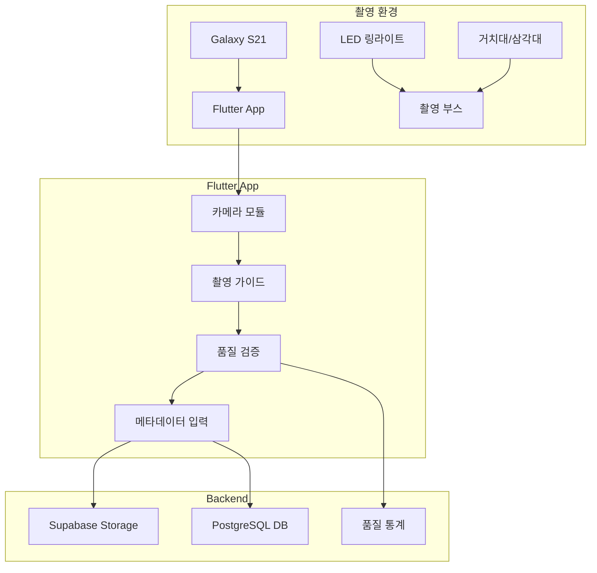

# 📸 Phase 2: 수집 시스템 구축 상세 계획

## 🎯 목표
실제 약품 사진 수집을 위한 **표준화된 촬영 환경**과 **품질 관리 시스템** 구축

## 📅 일정: 2024-10-23 ~ 2024-10-25 (3일)

## 🏗️ 시스템 아키텍처



## 📋 상세 작업

### Part A: 촬영 환경 준비

---

#### Task 1: LED 링라이트 6인치 + 삼각대 구매

**제품 사양**:
- **링라이트**: 6인치 (15cm) LED 링라이트
  - 색온도: 3000K-6500K 조절 가능
  - 밝기: 10단계 이상 조절
  - CRI: 95 이상
  - 전원: USB 전원 (보조배터리 연결 가능)
  - 예산: 20,000-25,000원

- **삼각대**: 탁상용 미니 삼각대
  - 높이: 20-40cm 조절 가능
  - 스마트폰 홀더 포함
  - 안정적인 3단 다리
  - 예산: 5,000-8,000원

**구매처 옵션**:
- 쿠팡: 당일/익일 배송
- 다나와: 가격 비교
- 오프라인: 용산/남대문 카메라 상가

---

#### Task 2: 유니버설 스마트폰 거치대 구매

**요구 사양**:
- Galaxy S21 호환 (6.2인치)
- 360도 회전 가능
- 나사 마운트 (1/4인치 표준)
- 스프링 클램프 방식
- 안정적인 고정력
- 예산: 10,000-15,000원

**설치 구성**:
```
     [LED 링라이트]
          |
    [스마트폰 거치대]
          |
      [Galaxy S21]
          |
      ↓ 15cm ↓
     [약품 위치]
     [백색 배경]
```

---

#### Task 3: A3 백색 무광 폼보드 + 투명 눈금자 구매

**구매 목록**:
| 품목 | 사양 | 수량 | 용도 | 예산 |
|------|------|------|------|------|
| A3 폼보드 | 5mm 두께, 무광 백색 | 5장 | 배경/바닥 | 10,000원 |
| 투명 눈금자 | 30cm, mm 단위 | 1개 | 크기 측정 | 3,000원 |
| 양면 테이프 | 폼 전용 | 1개 | 부스 제작 | 2,000원 |
| 검정 폼보드 | A4, 무광 | 2장 | 대비 촬영용 | 4,000원 |

**DIY 촬영 부스 설계**:
```
        후면 배경 (A3)
            ↑
           40cm
            |
    ┌───────────────┐
    │               │
    │   약품 위치    │ ← 15cm 마킹
    │       ●       │
    │               │
    └───────────────┘
        바닥 (A3)
```

---

#### Task 4: Galaxy S21 Pro Mode 설정

**카메라 설정 표준화**:

**Pro Mode 설정값**:
```
ISO: 100 (고정)
셔터스피드: 1/60s
화이트밸런스: 5000K (Daylight)
초점: Manual Focus (15cm 고정)
측광: 중앙중점측광
이미지 형식: JPEG (최고품질)
해상도: 64MP (9248×6936)
플래시: OFF
HDR: OFF
Scene Optimizer: OFF
```

**설정 저장**:
1. Pro Mode 진입
2. 각 값 수동 설정
3. 프리셋으로 저장 ("PillSnap")
4. 테스트 촬영으로 검증

**일관성 체크리스트**:
- [ ] 렌즈 깨끗이 청소
- [ ] 보호 케이스 제거
- [ ] 화면 밝기 최대
- [ ] 격자선 표시 ON
- [ ] 수평계 표시 ON

---

#### Task 5: DIY 촬영 부스 조립

**제작 단계**:

**Step 1: 기본 구조**
```bash
# 재료 준비
- A3 폼보드 2장 (바닥용, 배경용)
- L자 형태로 연결 (90도)
- 양면 테이프로 고정
```

**Step 2: 거리 마킹**
```bash
# 15cm 거리 표시
- 중앙점 마킹 (약품 위치)
- 좌우 가이드라인 (약품 정렬용)
- 크기 참조선 (5mm 간격)
```

**Step 3: 조명 위치**
```bash
# LED 위치 최적화
- 링라이트 중심: 카메라 렌즈 정렬
- 높이: 바닥에서 20cm
- 각도: 수직 하방 (그림자 최소화)
```

**Step 4: 캘리브레이션**
```python
# 테스트 촬영 프로토콜
1. 표준 참조물 촬영 (동전, 자)
2. 조명 밝기 조정 (과노출 방지)
3. 초점 거리 미세 조정
4. 색상 정확도 확인 (ColorChecker)
```

---

### Part B: Flutter 앱 개발

---

#### Task 6: Flutter 프로젝트 생성

**프로젝트 초기화**:
```bash
# Flutter 프로젝트 생성
flutter create pill_snap_collector
cd pill_snap_collector

# 필수 패키지 추가
flutter pub add camera
flutter pub add permission_handler
flutter pub add image
flutter pub add path_provider
flutter pub add supabase_flutter
flutter pub add provider
flutter pub add sqflite
flutter pub add dio
flutter pub add image_picker
flutter pub add flutter_image_compress
```

**프로젝트 구조**:
```
lib/
├── main.dart
├── models/
│   ├── drug.dart
│   └── photo_metadata.dart
├── screens/
│   ├── camera_screen.dart
│   ├── review_screen.dart
│   └── upload_screen.dart
├── widgets/
│   ├── camera_guide.dart
│   ├── quality_indicator.dart
│   └── metadata_form.dart
├── services/
│   ├── camera_service.dart
│   ├── quality_checker.dart
│   ├── supabase_service.dart
│   └── local_storage.dart
└── utils/
    ├── image_processor.dart
    └── constants.dart
```

---

#### Task 7: 카메라 패키지 통합 및 권한 설정

**Android 권한 (android/app/src/main/AndroidManifest.xml)**:
```xml
<uses-permission android:name="android.permission.CAMERA" />
<uses-permission android:name="android.permission.WRITE_EXTERNAL_STORAGE" />
<uses-permission android:name="android.permission.READ_EXTERNAL_STORAGE" />
<uses-feature android:name="android.hardware.camera" />
<uses-feature android:name="android.hardware.camera.autofocus" />
```

**카메라 서비스 구현**:
```dart
class CameraService {
  CameraController? _controller;
  List<CameraDescription>? cameras;

  Future<void> initializeCamera() async {
    cameras = await availableCameras();
    final camera = cameras!.firstWhere(
      (cam) => cam.lensDirection == CameraLensDirection.back
    );

    _controller = CameraController(
      camera,
      ResolutionPreset.veryHigh,
      enableAudio: false,
      imageFormatGroup: ImageFormatGroup.jpeg,
    );

    await _controller!.initialize();
    await _controller!.setFlashMode(FlashMode.off);
    await _controller!.setFocusMode(FocusMode.locked);
    await _controller!.setExposureMode(ExposureMode.locked);
  }

  Future<XFile?> takePicture() async {
    if (!_controller!.value.isInitialized) return null;

    try {
      final image = await _controller!.takePicture();
      return image;
    } catch (e) {
      print('Error taking picture: $e');
      return null;
    }
  }
}
```

---

#### Task 8: 촬영 가이드 UI

**UI 컴포넌트**:

**1. 중앙 정렬 박스**:
```dart
class AlignmentGuide extends StatelessWidget {
  @override
  Widget build(BuildContext context) {
    return CustomPaint(
      painter: AlignmentPainter(),
      child: Container(
        width: 200,
        height: 200,
        child: Center(
          child: Container(
            width: 150,
            height: 150,
            decoration: BoxDecoration(
              border: Border.all(color: Colors.green, width: 2),
              borderRadius: BorderRadius.circular(8),
            ),
          ),
        ),
      ),
    );
  }
}
```

**2. 3x3 그리드**:
```dart
class GridOverlay extends StatelessWidget {
  @override
  Widget build(BuildContext context) {
    return GridView.count(
      crossAxisCount: 3,
      children: List.generate(9, (index) {
        return Container(
          decoration: BoxDecoration(
            border: Border.all(
              color: Colors.white.withOpacity(0.3),
              width: 0.5,
            ),
          ),
        );
      }),
    );
  }
}
```

**3. 거리 표시기**:
```dart
class DistanceIndicator extends StatelessWidget {
  final double currentDistance = 15.0; // cm
  final double targetDistance = 15.0;

  @override
  Widget build(BuildContext context) {
    final isOptimal = (currentDistance - targetDistance).abs() < 1.0;

    return Container(
      padding: EdgeInsets.all(8),
      color: isOptimal ? Colors.green : Colors.orange,
      child: Text(
        '거리: ${currentDistance.toStringAsFixed(1)}cm',
        style: TextStyle(color: Colors.white),
      ),
    );
  }
}
```

---

#### Task 9: 실시간 품질 체크

**품질 검증 모듈**:

**1. 블러 검출 (Laplacian)**:
```dart
class BlurDetector {
  static double calculateLaplacian(Uint8List imageBytes) {
    final image = img.decodeImage(imageBytes)!;
    final grayscale = img.grayscale(image);

    // Laplacian kernel
    final kernel = [
      [0, 1, 0],
      [1, -4, 1],
      [0, 1, 0],
    ];

    double variance = 0;
    // Apply kernel and calculate variance
    // ... convolution implementation

    return variance; // Higher = sharper
  }

  static bool isBlurry(double laplacian) {
    return laplacian < 100.0; // Threshold
  }
}
```

**2. 노출 체크**:
```dart
class ExposureChecker {
  static ExposureQuality checkExposure(Uint8List imageBytes) {
    final image = img.decodeImage(imageBytes)!;
    final histogram = calculateHistogram(image);

    final meanBrightness = histogram.mean;
    final highlights = histogram.getPercentile(95);
    final shadows = histogram.getPercentile(5);

    if (highlights > 250) return ExposureQuality.overexposed;
    if (shadows < 5) return ExposureQuality.underexposed;
    if (meanBrightness < 50 || meanBrightness > 200) {
      return ExposureQuality.poor;
    }

    return ExposureQuality.good;
  }
}
```

**3. 중앙정렬 검증**:
```dart
class AlignmentChecker {
  static bool isAligned(Uint8List imageBytes) {
    // 1. Edge detection
    // 2. Find pill contour
    // 3. Calculate center point
    // 4. Check if center is within tolerance

    final pillCenter = detectPillCenter(imageBytes);
    final imageCenter = Point(width / 2, height / 2);
    final distance = calculateDistance(pillCenter, imageCenter);

    return distance < 50; // pixels
  }
}
```

**품질 점수 종합**:
```dart
class QualityScore {
  final double blur;
  final ExposureQuality exposure;
  final bool aligned;

  String get grade {
    if (blur > 150 && exposure == ExposureQuality.good && aligned) {
      return 'A';
    } else if (blur > 100 && exposure != ExposureQuality.poor) {
      return 'B';
    } else {
      return 'C';
    }
  }

  bool get needsRetake => grade == 'C';
}
```

---

#### Task 10: 약품 정보 입력 폼

**메타데이터 입력 UI**:

```dart
class MetadataForm extends StatefulWidget {
  @override
  Widget build(BuildContext context) {
    return Form(
      child: Column(
        children: [
          // K-CODE 검색
          TypeAheadFormField(
            textFieldConfiguration: TextFieldConfiguration(
              controller: _kcodeController,
              decoration: InputDecoration(
                labelText: 'K-CODE 검색',
                prefixIcon: Icon(Icons.search),
              ),
            ),
            suggestionsCallback: (pattern) async {
              return await searchKCodes(pattern);
            },
            itemBuilder: (context, suggestion) {
              return ListTile(
                title: Text(suggestion.kcode),
                subtitle: Text(suggestion.drugName),
              );
            },
            onSuggestionSelected: (suggestion) {
              setState(() {
                selectedDrug = suggestion;
              });
            },
          ),

          // 약품명 (자동 입력)
          TextFormField(
            controller: _drugNameController,
            decoration: InputDecoration(labelText: '약품명'),
            enabled: false,
          ),

          // 촬영 각도
          DropdownButtonFormField<String>(
            value: photoAngle,
            decoration: InputDecoration(labelText: '촬영 각도'),
            items: ['앞면', '뒷면', '옆면']
                .map((angle) => DropdownMenuItem(
                      value: angle,
                      child: Text(angle),
                    ))
                .toList(),
            onChanged: (value) {
              setState(() {
                photoAngle = value!;
              });
            },
          ),

          // 품질 등급 (자동)
          TextFormField(
            controller: _qualityController,
            decoration: InputDecoration(
              labelText: '품질 등급',
              suffixIcon: Icon(
                getQualityIcon(qualityGrade),
                color: getQualityColor(qualityGrade),
              ),
            ),
            enabled: false,
          ),

          // 메모
          TextFormField(
            controller: _notesController,
            decoration: InputDecoration(
              labelText: '메모 (선택)',
              hintText: '특이사항 입력',
            ),
            maxLines: 2,
          ),
        ],
      ),
    );
  }
}
```

---

#### Task 11: Supabase 연동

**Supabase 초기화**:
```dart
// main.dart
void main() async {
  WidgetsFlutterBinding.ensureInitialized();

  await Supabase.initialize(
    url: 'YOUR_SUPABASE_URL',
    anonKey: 'YOUR_ANON_KEY',
  );

  runApp(MyApp());
}
```

**Storage 업로드**:
```dart
class SupabaseService {
  final supabase = Supabase.instance.client;

  Future<String?> uploadImage(
    Uint8List imageBytes,
    String kcode,
    String angle,
  ) async {
    try {
      final timestamp = DateTime.now().millisecondsSinceEpoch;
      final fileName = '${kcode}_${angle}_$timestamp.jpg';
      final path = 'pill-images/$kcode/$fileName';

      await supabase.storage
          .from('pill-images')
          .uploadBinary(path, imageBytes);

      final url = supabase.storage
          .from('pill-images')
          .getPublicUrl(path);

      return url;
    } catch (e) {
      print('Upload error: $e');
      return null;
    }
  }

  Future<bool> saveMetadata(PhotoMetadata metadata) async {
    try {
      await supabase
          .from('real_photo_metadata')
          .insert(metadata.toJson());

      return true;
    } catch (e) {
      print('Metadata save error: $e');
      return false;
    }
  }
}
```

**오프라인 큐**:
```dart
class OfflineQueue {
  final _db = await openDatabase('offline_queue.db');

  Future<void> addToQueue(PhotoData data) async {
    await _db.insert('queue', data.toMap());
  }

  Future<void> processQueue() async {
    final items = await _db.query('queue');

    for (final item in items) {
      final success = await uploadPhoto(item);
      if (success) {
        await _db.delete('queue', where: 'id = ?', whereArgs: [item['id']]);
      }
    }
  }
}
```

---

#### Task 12: APK 빌드 및 Galaxy S21 설치

**빌드 프로세스**:
```bash
# 1. 빌드 설정 확인
flutter doctor

# 2. Release APK 빌드
flutter build apk --release

# 3. Bundle 크기 최적화
flutter build apk --split-per-abi

# 출력 파일:
# build/app/outputs/flutter-apk/app-armeabi-v7a-release.apk
# build/app/outputs/flutter-apk/app-arm64-v8a-release.apk
```

**설치 방법**:
1. **ADB 설치**:
```bash
adb install build/app/outputs/flutter-apk/app-release.apk
```

2. **파일 전송**:
- APK를 Google Drive 업로드
- Galaxy S21에서 다운로드
- 설정 > 보안 > "출처를 알 수 없는 앱" 허용
- APK 실행 및 설치

3. **테스트 체크리스트**:
- [ ] 카메라 권한 요청 정상
- [ ] 촬영 가이드 표시
- [ ] 품질 검증 작동
- [ ] Supabase 업로드 성공
- [ ] 오프라인 모드 작동

---

### Part C: Supabase 백엔드 설정

---

#### Task 13: Supabase 프로젝트 생성

**프로젝트 설정**:
```yaml
Project Name: pillsnap-collector
Region: Northeast Asia (Tokyo)
Database Password: [강력한 비밀번호 생성]
Pricing Plan: Free tier
```

**환경변수 저장**:
```bash
# .env 파일
SUPABASE_URL=https://xxxxx.supabase.co
SUPABASE_ANON_KEY=eyJhbGciOiJIUzI1NiIsInR5cCI6IkpXVCJ9...
SUPABASE_SERVICE_KEY=eyJhbGciOiJIUzI1NiIsInR5cCI6IkpXVCJ9...
```

---

#### Task 14: Storage Bucket 생성

**Bucket 구조**:
```sql
-- Storage buckets
CREATE POLICY "Public read access" ON storage.objects
  FOR SELECT USING (bucket_id = 'pill-images');

CREATE POLICY "Authenticated upload" ON storage.objects
  FOR INSERT WITH CHECK (
    bucket_id = 'pill-images' AND
    auth.role() = 'authenticated'
  );
```

**폴더 구조**:
```
pill-images/
├── K001234/           # K-CODE별 폴더
│   ├── K001234_front_1698043521234.jpg
│   ├── K001234_back_1698043528456.jpg
│   └── K001234_side_1698043535789.jpg
├── K002345/
│   └── ...
└── temp/              # 임시 업로드
    └── processing/
```

---

#### Task 15: 테이블 스키마 생성

**real_photo_metadata 테이블**:
```sql
CREATE TABLE real_photo_metadata (
  id UUID DEFAULT uuid_generate_v4() PRIMARY KEY,
  kcode VARCHAR(20) NOT NULL,
  drug_name VARCHAR(200) NOT NULL,
  image_url TEXT NOT NULL,
  photo_angle VARCHAR(20) NOT NULL CHECK (photo_angle IN ('front', 'back', 'side')),
  quality_grade CHAR(1) NOT NULL CHECK (quality_grade IN ('A', 'B', 'C')),
  quality_metrics JSONB NOT NULL,
  device_info JSONB NOT NULL,
  camera_settings JSONB NOT NULL,
  captured_at TIMESTAMP NOT NULL,
  uploaded_at TIMESTAMP DEFAULT NOW(),
  photographer_id VARCHAR(50),
  notes TEXT,
  is_validated BOOLEAN DEFAULT FALSE,
  validation_notes TEXT,

  -- Indexes
  INDEX idx_kcode (kcode),
  INDEX idx_quality (quality_grade),
  INDEX idx_captured_at (captured_at DESC)
);

-- Quality metrics JSONB structure:
-- {
--   "blur_score": 156.3,
--   "exposure": "good",
--   "alignment": true,
--   "file_size_kb": 245,
--   "resolution": "4624x3468"
-- }
```

**kcode_statistics 테이블**:
```sql
CREATE TABLE kcode_statistics (
  kcode VARCHAR(20) PRIMARY KEY,
  drug_name VARCHAR(200) NOT NULL,
  total_photos INTEGER DEFAULT 0,
  photos_a_grade INTEGER DEFAULT 0,
  photos_b_grade INTEGER DEFAULT 0,
  photos_c_grade INTEGER DEFAULT 0,
  front_photos INTEGER DEFAULT 0,
  back_photos INTEGER DEFAULT 0,
  side_photos INTEGER DEFAULT 0,
  last_captured_at TIMESTAMP,
  avg_quality_score DECIMAL(3,2),
  is_complete BOOLEAN DEFAULT FALSE,
  updated_at TIMESTAMP DEFAULT NOW()
);

-- Trigger to update statistics
CREATE OR REPLACE FUNCTION update_kcode_statistics()
RETURNS TRIGGER AS $$
BEGIN
  INSERT INTO kcode_statistics (kcode, drug_name, total_photos)
  VALUES (NEW.kcode, NEW.drug_name, 1)
  ON CONFLICT (kcode) DO UPDATE
  SET
    total_photos = kcode_statistics.total_photos + 1,
    photos_a_grade = CASE
      WHEN NEW.quality_grade = 'A' THEN kcode_statistics.photos_a_grade + 1
      ELSE kcode_statistics.photos_a_grade
    END,
    -- ... other updates
    last_captured_at = NEW.captured_at,
    updated_at = NOW();

  RETURN NEW;
END;
$$ LANGUAGE plpgsql;

CREATE TRIGGER trigger_update_statistics
  AFTER INSERT ON real_photo_metadata
  FOR EACH ROW
  EXECUTE FUNCTION update_kcode_statistics();
```

---

#### Task 16: RLS (Row Level Security) 정책 설정

**보안 정책**:
```sql
-- Enable RLS
ALTER TABLE real_photo_metadata ENABLE ROW LEVEL SECURITY;
ALTER TABLE kcode_statistics ENABLE ROW LEVEL SECURITY;

-- Policies for real_photo_metadata
CREATE POLICY "Authenticated users can insert"
  ON real_photo_metadata
  FOR INSERT
  TO authenticated
  WITH CHECK (true);

CREATE POLICY "Anyone can view"
  ON real_photo_metadata
  FOR SELECT
  TO anon, authenticated
  USING (true);

CREATE POLICY "Only admins can update"
  ON real_photo_metadata
  FOR UPDATE
  TO authenticated
  USING (auth.jwt()->>'role' = 'admin')
  WITH CHECK (auth.jwt()->>'role' = 'admin');

-- Policies for kcode_statistics
CREATE POLICY "Anyone can view statistics"
  ON kcode_statistics
  FOR SELECT
  TO anon, authenticated
  USING (true);
```

**API 키 관리**:
```javascript
// Supabase Dashboard > Settings > API
// Service Role Key: 전체 권한 (서버만 사용)
// Anon Key: 제한된 권한 (Flutter 앱 사용)
```

---

## 📊 품질 기준 및 검증

### 촬영 품질 등급

| 등급 | Blur Score | 노출 | 정렬 | 용도 |
|------|------------|------|------|------|
| **A** | > 150 | Good | ✓ | 학습 데이터 |
| **B** | 100-150 | Fair | ✓ | 보조 데이터 |
| **C** | < 100 | Poor | ✗ | 재촬영 필요 |

### 일일 목표
- 최소 촬영: 20개 약품
- 약품당: 10장 (앞3, 뒤3, 옆4)
- A등급 비율: > 70%
- 업로드 성공률: > 95%

## 🔧 개발 환경 설정

**Flutter 개발 환경**:
```bash
# Flutter 설치 확인
flutter doctor

# 필요 도구
- Flutter SDK 3.0+
- Android Studio / VS Code
- Android SDK 30+
- ADB tools
```

**디버깅 설정**:
```json
// launch.json (VS Code)
{
  "version": "0.2.0",
  "configurations": [
    {
      "name": "pill_snap_collector",
      "request": "launch",
      "type": "dart",
      "args": ["--flavor", "dev"]
    }
  ]
}
```

## ⚠️ 주의사항

1. **개인정보**: 환자 정보 절대 수집 금지
2. **저작권**: 약품 포장 디자인 저작권 확인
3. **보안**: Supabase 키 Git 커밋 금지
4. **품질**: C등급 사진 즉시 재촬영
5. **백업**: 매일 로컬 백업 수행

## 📝 산출물

1. **하드웨어**:
   - 완성된 DIY 촬영 부스
   - 표준화된 촬영 환경

2. **소프트웨어**:
   - Flutter 수집 앱 APK
   - Supabase 백엔드 구축

3. **문서**:
   - 촬영 프로토콜 가이드
   - 품질 기준 문서

## 🔗 다음 단계
Phase 3: 실제 약품 사진 수집 - 파일럿 테스트 및 본격 촬영