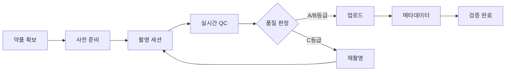

# 📷 Phase 3: 실제 약품 사진 수집 상세 계획

## 🎯 목표
100개 약품의 **고품질 실사진 1,000장 이상** 확보 및 품질 검증 완료

## 📅 일정: 2024-10-26 ~ 2024-10-27 (2일 파일럿) + 2024-10-28 ~ 2024-11-01 (5일 본촬영)

## 📊 수집 목표 및 메트릭

| 구분 | 목표 | 최소 요구사항 | 품질 기준 |
|------|------|--------------|----------|
| **파일럿** | 30개 약품 × 10장 = 300장 | 270장 | A등급 60% |
| **본촬영** | 70개 약품 × 15장 = 1,050장 | 700장 | A등급 70% |
| **전체** | 100개 약품, 1,350장 | 1,000장 | A등급 70% |

## 🔄 수집 워크플로우



## 📋 상세 작업

### Part A: 파일럿 테스트 (2일)

---

#### Task 1: 상위 30개 약품 실물 확보

**확보 전략**:

**1차 소스 - 약국 구매 (20개)**:
```yaml
방문 약국: 3-4곳 (지역 분산)
구매 방법:
  - 일반의약품: 직접 구매
  - 전문의약품: 샘플 요청 (약사 협조)
예상 비용: 30,000-50,000원
준비물:
  - 구매 리스트 (인쇄물)
  - 약품 보관용 지퍼백
  - 라벨 스티커
```

**2차 소스 - 온라인 (10개)**:
```yaml
구매처:
  - 약국 온라인몰 (일반의약품)
  - 의료기기 도매상 (샘플팩)
예상 비용: 20,000-30,000원
배송 기간: 1-2일
```

**약품 관리 시스템**:
```python
# 약품 관리 스프레드시트 구조
drug_inventory = {
    "K001234": {
        "name": "타이레놀500mg",
        "quantity": 3,  # 확보 수량
        "source": "약국A",
        "purchase_date": "2024-10-26",
        "expiry_date": "2025-12-31",
        "storage_location": "Box_A_01",
        "photo_status": "pending"  # pending/partial/complete
    }
}
```

**보관 방법**:
- 약품별 개별 지퍼백 보관
- K-CODE 라벨 부착
- 온도: 15-25°C (실온)
- 습도: 40-60%
- 직사광선 차단

---

#### Task 2: 30개 약품 × 10장 = 300장 촬영

**촬영 계획**:

**일일 스케줄**:
| 시간 | 활동 | 목표 |
|------|------|------|
| 09:00-09:30 | 장비 세팅 | 조명, 카메라 캘리브레이션 |
| 09:30-12:00 | 오전 촬영 | 10개 약품 (100장) |
| 12:00-13:00 | 점심 및 데이터 백업 | |
| 13:00-16:00 | 오후 촬영 | 10개 약품 (100장) |
| 16:00-17:00 | 품질 검토 | QC 및 재촬영 리스트 |
| 17:00-18:00 | 데이터 업로드 | Supabase 동기화 |

**촬영 프로토콜**:
```python
class PhotoSession:
    def capture_drug(self, drug_id: str):
        angles = {
            'front': 3,   # 정면 3장
            'back': 3,    # 후면 3장
            'side': 4     # 측면 4장 (90도씩 회전)
        }

        for angle, count in angles.items():
            for i in range(count):
                # 1. 약품 배치
                self.position_drug(angle)

                # 2. 조명 확인
                self.check_lighting()

                # 3. 초점 맞추기
                self.lock_focus()

                # 4. 촬영
                photo = self.capture()

                # 5. 즉시 품질 체크
                quality = self.check_quality(photo)

                if quality.grade == 'C':
                    # 즉시 재촬영
                    self.retake(angle, i)

                # 6. 메타데이터 기록
                self.save_metadata(drug_id, angle, quality)
```

**각도별 촬영 가이드**:

**정면 (Front)**:
- 주요 각인/로고 중심
- 수평 정렬 확인
- 3장: 기본, ±5도 회전

**후면 (Back)**:
- 제조사 정보 포함
- 분할선 명확히
- 3장: 기본, 약간 위/아래

**측면 (Side)**:
- 두께 파악 가능
- 90도씩 회전
- 4장: 0°, 90°, 180°, 270°

---

#### Task 3: QC 검증 - A/B/C 등급 분류

**품질 검증 체크리스트**:

**A등급 기준 (학습 데이터)**:
- [x] Laplacian Score > 150
- [x] 노출 정상 (히스토그램 중앙)
- [x] 중앙 정렬 (±30px)
- [x] 배경 균일
- [x] 그림자 최소
- [x] 전체 약품 visible
- [x] 해상도 > 2000px

**B등급 기준 (보조 데이터)**:
- [x] Laplacian Score 100-150
- [x] 노출 약간 부족/과다
- [x] 정렬 약간 벗어남 (±50px)
- [ ] 미세한 그림자
- [x] 약품 90% 이상 visible

**C등급 (재촬영 필요)**:
- [ ] Laplacian Score < 100 (흐림)
- [ ] 심각한 노출 문제
- [ ] 중앙 정렬 실패
- [ ] 약품 일부 잘림
- [ ] 배경 오염

**품질 분포 분석**:
```python
def analyze_quality_distribution(photos):
    stats = {
        'A': 0, 'B': 0, 'C': 0,
        'by_drug': {},
        'by_angle': {'front': {}, 'back': {}, 'side': {}},
        'common_issues': []
    }

    for photo in photos:
        grade = photo.quality_grade
        stats[grade] += 1

        # 약품별 통계
        drug = photo.drug_id
        if drug not in stats['by_drug']:
            stats['by_drug'][drug] = {'A': 0, 'B': 0, 'C': 0}
        stats['by_drug'][drug][grade] += 1

        # 각도별 통계
        angle = photo.angle
        stats['by_angle'][angle][grade] = \
            stats['by_angle'][angle].get(grade, 0) + 1

        # 문제 패턴 수집
        if grade == 'C':
            stats['common_issues'].append(photo.issue_type)

    return stats
```

**재촬영 우선순위**:
1. **긴급**: 약품당 A등급 < 3장
2. **높음**: 특정 각도 누락
3. **보통**: B등급 > 50%
4. **낮음**: 추가 샘플 필요

---

#### Task 4: 촬영 프로토콜 개선

**문제점 분석 및 개선**:

**조명 문제**:
```yaml
문제:
  - 반사광으로 각인 불명확
  - 그림자 발생

해결:
  - Diffuser 추가 (트레이싱 페이퍼)
  - 링라이트 각도 조정 (15° 기울임)
  - 보조 LED 추가 (측면 fill light)
```

**초점 문제**:
```yaml
문제:
  - 소형 약품 초점 실패
  - 곡면 약품 부분 blur

해결:
  - Focus stacking 기법 적용
  - 조리개 조정 (f/8 → f/11)
  - 매크로 렌즈 클립 추가 고려
```

**정렬 문제**:
```yaml
문제:
  - 원형 약품 회전
  - 캡슐 기울어짐

해결:
  - 약품 고정용 투명 아크릴 가이드
  - 실리콘 패드 사용 (미끄럼 방지)
  - AR 정렬 가이드 앱 기능 추가
```

**프로토콜 v2.0 업데이트**:
```markdown
## 개선된 촬영 프로토콜 v2.0

### 사전 준비 (5분)
1. 렌즈 청소 (마이크로파이버)
2. 조명 워밍업 (2분)
3. 화이트밸런스 캘리브레이션
4. 테스트 촬영 (표준 참조물)

### 촬영 단계 (약품당 3분)
1. 약품 식별 및 라벨 확인
2. 먼지 제거 (에어 블로어)
3. 위치 조정 (가이드 활용)
4. 조명 확인 (그림자 체크)
5. 포커스 락 (중앙점)
6. 연속 촬영 (버스트 모드 3장)
7. 즉시 품질 확인 (앱)
8. 다음 각도 전환

### 후처리 (10분/100장)
1. 자동 품질 분류
2. 메타데이터 검증
3. 재촬영 리스트 생성
4. 클라우드 동기화
```

---

### Part B: 본격 수집 (5일)

---

#### Task 5: 100개 약품 확보 계획 수립

**조달 계획**:

**Phase별 확보 전략**:
```yaml
Week 1 (30개):
  - 일반의약품 위주
  - 대형 약국 3곳
  - 예산: 50,000원

Week 2 (40개):
  - 전문의약품 포함
  - 병원 약국 협조
  - 도매상 샘플
  - 예산: 70,000원

Week 3 (30개):
  - 희귀 약품
  - 특수 제형
  - 온라인 구매
  - 예산: 50,000원
```

**협력 네트워크**:
- 지역 약사회 협조 요청
- 의약품 도매상 컨택
- 제약회사 샘플 요청
- 병원 약제부 협력

**예산 계획**:
| 항목 | 금액 | 비고 |
|------|------|------|
| 약품 구매 | 150,000원 | 100개 |
| 샘플/기부 | 0원 | 협조 |
| 배송비 | 20,000원 | |
| 보관용품 | 10,000원 | 박스, 지퍼백 |
| **총계** | **180,000원** | |

---

#### Task 6: 일일 20개씩 5일간 촬영

**5일 집중 촬영 계획**:

**Day 1 (월) - 고빈도 진통제**:
```yaml
대상: 타이레놀, 부루펜, 낙센, 펜잘, 게보린 등
목표: 20개 × 15장 = 300장
특징: 크기 적당, 각인 명확
난이도: ★☆☆☆☆
```

**Day 2 (화) - 소화제/위장약**:
```yaml
대상: 베아제, 훼스탈, 개비스콘, 무코스타 등
목표: 20개 × 15장 = 300장
특징: 다양한 색상, 코팅
난이도: ★★☆☆☆
```

**Day 3 (수) - 항생제/감기약**:
```yaml
대상: 아목시실린, 세파클러, 코대원, 화이투벤 등
목표: 20개 × 15장 = 300장
특징: 캡슐 多, PTP 포장
난이도: ★★★☆☆
```

**Day 4 (목) - 만성질환약**:
```yaml
대상: 아스피린, 리피토, 노바스크, 다이아벡스 등
목표: 20개 × 15장 = 300장
특징: 소형, 분할선
난이도: ★★★★☆
```

**Day 5 (금) - 특수제형/보충촬영**:
```yaml
대상: 서방정, 연질캡슐, 재촬영 필요 약품
목표: 20개 × 15장 = 300장
특징: 특수 코팅, 불규칙 형태
난이도: ★★★★★
```

**일일 체크리스트**:
```markdown
## Daily Checklist

### 오전 준비 (08:30-09:00)
- [ ] 장비 점검 (카메라, 조명)
- [ ] 약품 준비 (20개 세트)
- [ ] Flutter 앱 실행
- [ ] Supabase 연결 확인

### 촬영 세션 (09:00-17:00)
- [ ] Session 1: 09:00-10:30 (5개)
- [ ] Session 2: 10:30-12:00 (5개)
- [ ] Session 3: 13:00-14:30 (5개)
- [ ] Session 4: 14:30-16:00 (5개)
- [ ] QC & 재촬영: 16:00-17:00

### 마무리 (17:00-18:00)
- [ ] 데이터 업로드 확인
- [ ] 품질 통계 기록
- [ ] 재촬영 리스트 작성
- [ ] 장비 정리
- [ ] 일일 보고서 작성
```

---

#### Task 7: 품질 A등급 70% 이상 확보 검증

**품질 모니터링 대시보드**:

```python
class QualityMonitor:
    def __init__(self):
        self.target_a_grade = 0.70
        self.minimum_photos_per_drug = 10

    def generate_daily_report(self, date):
        report = {
            'date': date,
            'total_photos': 0,
            'a_grade': 0,
            'b_grade': 0,
            'c_grade': 0,
            'a_grade_ratio': 0.0,
            'drugs_complete': 0,
            'drugs_incomplete': [],
            'retake_required': []
        }

        # 일별 통계 계산
        photos = self.get_photos_by_date(date)
        report['total_photos'] = len(photos)

        for photo in photos:
            if photo.grade == 'A':
                report['a_grade'] += 1
            elif photo.grade == 'B':
                report['b_grade'] += 1
            else:
                report['c_grade'] += 1

        report['a_grade_ratio'] = report['a_grade'] / report['total_photos']

        # 약품별 완성도 체크
        drugs = self.get_unique_drugs(photos)
        for drug in drugs:
            drug_photos = self.get_drug_photos(drug)
            a_count = sum(1 for p in drug_photos if p.grade == 'A')

            if a_count >= 7:  # 70% of 10 photos
                report['drugs_complete'] += 1
            else:
                report['drugs_incomplete'].append({
                    'drug_id': drug,
                    'a_grade_count': a_count,
                    'needed': 7 - a_count
                })

        return report

    def generate_cumulative_stats(self):
        """전체 진행 상황 통계"""
        return {
            'total_drugs_targeted': 100,
            'drugs_photographed': self.count_photographed_drugs(),
            'total_photos': self.count_total_photos(),
            'a_grade_photos': self.count_a_grade_photos(),
            'overall_a_ratio': self.calculate_overall_a_ratio(),
            'estimated_completion': self.estimate_completion_date(),
            'quality_trend': self.analyze_quality_trend()
        }
```

**품질 개선 액션 플랜**:

| A등급 비율 | 상태 | 액션 |
|-----------|------|------|
| > 75% | 🟢 우수 | 현행 유지 |
| 70-75% | 🟡 양호 | 미세 조정 |
| 60-70% | 🟠 주의 | 프로토콜 점검 |
| < 60% | 🔴 위험 | 즉시 개선 필요 |

**개선 조치**:
1. **조명 보강**: 추가 LED 패널
2. **안정화**: 타이머 촬영 사용
3. **교육**: 촬영 기법 재교육
4. **장비 점검**: 렌즈 청소, 캘리브레이션

---

#### Task 8: Supabase 업로드 및 메타데이터 정리

**자동 업로드 파이프라인**:

```dart
// Flutter 앱 - 자동 동기화
class AutoUploadService {
  final _uploadQueue = Queue<PhotoData>();
  Timer? _uploadTimer;

  void startAutoUpload() {
    _uploadTimer = Timer.periodic(Duration(seconds: 30), (timer) async {
      if (_uploadQueue.isNotEmpty && await isNetworkAvailable()) {
        await processUploadQueue();
      }
    });
  }

  Future<void> processUploadQueue() async {
    while (_uploadQueue.isNotEmpty) {
      final photo = _uploadQueue.removeFirst();

      try {
        // 1. 이미지 압축 (품질 유지)
        final compressed = await compressImage(
          photo.imageBytes,
          quality: 85,
          maxWidth: 3000,
        );

        // 2. Supabase 업로드
        final url = await supabase.uploadImage(
          compressed,
          photo.kcode,
          photo.angle,
        );

        // 3. 메타데이터 저장
        await supabase.saveMetadata(
          PhotoMetadata(
            kcode: photo.kcode,
            drugName: photo.drugName,
            imageUrl: url,
            angle: photo.angle,
            qualityGrade: photo.qualityGrade,
            qualityMetrics: photo.metrics,
            deviceInfo: getDeviceInfo(),
            cameraSettings: photo.cameraSettings,
            capturedAt: photo.timestamp,
          ),
        );

        // 4. 로컬 DB 업데이트
        await localDb.markAsUploaded(photo.id);

        print('✅ Uploaded: ${photo.kcode}_${photo.angle}');
      } catch (e) {
        print('❌ Upload failed: $e');
        _uploadQueue.add(photo); // 재시도 큐에 추가
      }
    }
  }
}
```

**메타데이터 정리 및 검증**:

```sql
-- 일일 데이터 검증 쿼리
WITH daily_stats AS (
  SELECT
    DATE(captured_at) as capture_date,
    kcode,
    drug_name,
    COUNT(*) as total_photos,
    SUM(CASE WHEN quality_grade = 'A' THEN 1 ELSE 0 END) as a_grade,
    SUM(CASE WHEN quality_grade = 'B' THEN 1 ELSE 0 END) as b_grade,
    SUM(CASE WHEN quality_grade = 'C' THEN 1 ELSE 0 END) as c_grade,
    ARRAY_AGG(DISTINCT photo_angle) as angles
  FROM real_photo_metadata
  WHERE DATE(captured_at) = CURRENT_DATE
  GROUP BY DATE(captured_at), kcode, drug_name
)
SELECT
  capture_date,
  COUNT(DISTINCT kcode) as drugs_captured,
  SUM(total_photos) as total_photos,
  SUM(a_grade) as total_a_grade,
  ROUND(100.0 * SUM(a_grade) / SUM(total_photos), 2) as a_grade_percentage,
  ARRAY_AGG(
    CASE
      WHEN total_photos < 10 THEN kcode
      ELSE NULL
    END
  ) FILTER (WHERE total_photos < 10) as incomplete_drugs
FROM daily_stats
GROUP BY capture_date;
```

**데이터 백업 전략**:
```bash
#!/bin/bash
# daily_backup.sh

DATE=$(date +%Y%m%d)
BACKUP_DIR="/backup/pillsnap/$DATE"

# 1. Supabase 데이터 Export
supabase db dump --project-ref xxxxx > "$BACKUP_DIR/database_$DATE.sql"

# 2. Storage 파일 동기화
rclone sync supabase:pill-images "$BACKUP_DIR/images/"

# 3. 메타데이터 JSON Export
psql $DATABASE_URL -c "
  COPY (
    SELECT json_agg(row_to_json(t))
    FROM real_photo_metadata t
    WHERE DATE(captured_at) = CURRENT_DATE
  ) TO '$BACKUP_DIR/metadata_$DATE.json'
"

# 4. 압축 및 암호화
tar -czf "$BACKUP_DIR.tar.gz" "$BACKUP_DIR"
gpg -c "$BACKUP_DIR.tar.gz"

echo "✅ Backup completed: $BACKUP_DIR.tar.gz.gpg"
```

---

## 📊 성과 지표 및 마일스톤

### 주요 KPI

| 지표 | 목표 | 최소 | 측정 방법 |
|------|------|------|-----------|
| **총 사진 수** | 1,350장 | 1,000장 | Supabase 카운트 |
| **A등급 비율** | 70% | 60% | 품질 통계 |
| **약품 커버리지** | 100개 | 90개 | Unique K-CODE |
| **일일 생산성** | 270장/일 | 200장/일 | 일별 통계 |
| **업로드 성공률** | 99% | 95% | 실패 로그 |

### 체크포인트

**파일럿 완료 (Day 2)**:
- [ ] 30개 약품 촬영 완료
- [ ] 300장 이상 확보
- [ ] A등급 60% 달성
- [ ] 프로토콜 v2.0 확정

**중간 점검 (Day 5)**:
- [ ] 50개 약품 완료
- [ ] 650장 이상 확보
- [ ] 품질 트렌드 분석
- [ ] 문제 약품 식별

**최종 완료 (Day 7)**:
- [ ] 100개 약품 완료
- [ ] 1,000장 이상 확보
- [ ] A등급 70% 달성
- [ ] 전체 데이터 검증

## 🚨 리스크 관리

### 예상 문제 및 대응

**약품 확보 실패**:
- 리스크: 특정 약품 구매 불가
- 대응: 대체 약품 리스트 준비 (120개)

**품질 기준 미달**:
- 리스크: A등급 60% 미만
- 대응: 추가 촬영일 확보, 장비 업그레이드

**장비 고장**:
- 리스크: 스마트폰 고장
- 대응: 백업 디바이스 준비 (구형 스마트폰)

**데이터 손실**:
- 리스크: 업로드 실패, 로컬 손상
- 대응: 실시간 백업, 다중 저장소

## 📝 산출물

1. **데이터셋**:
   - 1,000+ 고품질 실사진
   - 100개 약품 완전 커버
   - A등급 70% 이상

2. **메타데이터**:
   - 완전한 EXIF 정보
   - 품질 점수 및 메트릭
   - 촬영 조건 기록

3. **문서**:
   - 촬영 프로토콜 v2.0
   - 품질 분석 리포트
   - 개선 제안서

## 🔗 다음 단계
Phase 4: 모델 학습 - 실사진 통합 학습 및 성능 최적화