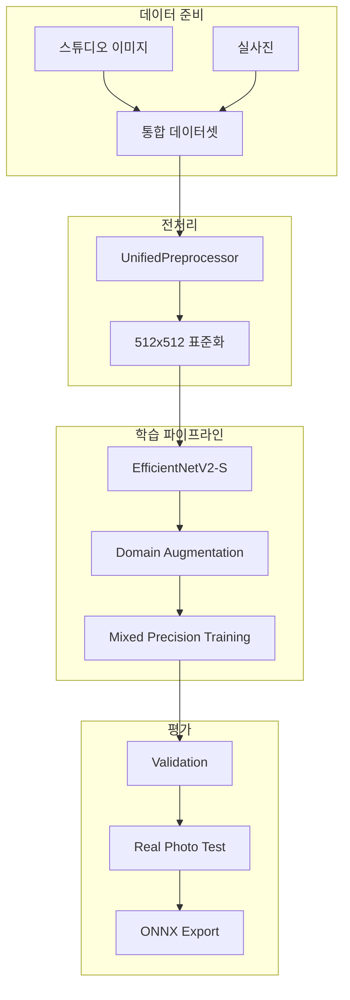

# 🤖 Phase 4: 모델 학습 상세 계획

## 🎯 목표
100개 약품에 특화된 **고성능 AI 모델** 개발 (Top-1 85%, Top-5 95% 정확도)

## 📅 일정: 2024-11-02 ~ 2024-11-08 (7일)

## 🏗️ 학습 아키텍처



## 📋 상세 작업

### Part A: 전처리 표준화

---

#### Task 1: UnifiedPreprocessor 클래스 구현

**목적**: Flutter, BFF, 추론서버 간 일관된 전처리 보장

**구현 코드**:
```python
# src/preprocessing/unified_preprocessor.py

import cv2
import numpy as np
from typing import Tuple, Optional
import torch
from torchvision import transforms

class UnifiedPreprocessor:
    """
    모든 파이프라인에서 사용하는 표준 전처리기
    Flutter → BFF → Inference 일관성 보장
    """

    def __init__(
        self,
        target_size: int = 512,
        enable_clahe: bool = True,
        clahe_clip_limit: float = 2.0,
        clahe_grid_size: int = 8,
        normalization_mean: Tuple[float, float, float] = (0.485, 0.456, 0.406),
        normalization_std: Tuple[float, float, float] = (0.229, 0.224, 0.225)
    ):
        self.target_size = target_size
        self.enable_clahe = enable_clahe
        self.clahe_clip_limit = clahe_clip_limit
        self.clahe_grid_size = clahe_grid_size
        self.mean = normalization_mean
        self.std = normalization_std

        # CLAHE 객체 생성
        if enable_clahe:
            self.clahe = cv2.createCLAHE(
                clipLimit=clahe_clip_limit,
                tileGridSize=(clahe_grid_size, clahe_grid_size)
            )

    def process(self, image: np.ndarray) -> torch.Tensor:
        """
        이미지 전처리 파이프라인

        Args:
            image: RGB 이미지 (H, W, 3)

        Returns:
            torch.Tensor: 전처리된 텐서 (3, 512, 512)
        """
        # 1. 크기 조정 (중앙 크롭 후 리사이즈)
        image = self._center_crop_and_resize(image)

        # 2. CLAHE 적용 (선택적)
        if self.enable_clahe:
            image = self._apply_clahe(image)

        # 3. 정규화
        image = self._normalize(image)

        # 4. 텐서 변환
        tensor = torch.from_numpy(image).permute(2, 0, 1).float()

        return tensor

    def _center_crop_and_resize(self, image: np.ndarray) -> np.ndarray:
        """중앙 크롭 후 정사각형 리사이즈"""
        h, w = image.shape[:2]

        # 정사각형 크롭
        min_dim = min(h, w)
        start_h = (h - min_dim) // 2
        start_w = (w - min_dim) // 2
        cropped = image[start_h:start_h+min_dim, start_w:start_w+min_dim]

        # 리사이즈
        resized = cv2.resize(
            cropped,
            (self.target_size, self.target_size),
            interpolation=cv2.INTER_LINEAR
        )

        return resized

    def _apply_clahe(self, image: np.ndarray) -> np.ndarray:
        """CLAHE (Contrast Limited Adaptive Histogram Equalization) 적용"""
        # RGB to LAB
        lab = cv2.cvtColor(image, cv2.COLOR_RGB2LAB)
        l, a, b = cv2.split(lab)

        # L 채널에 CLAHE 적용
        l_clahe = self.clahe.apply(l)

        # LAB to RGB
        lab_clahe = cv2.merge([l_clahe, a, b])
        rgb_clahe = cv2.cvtColor(lab_clahe, cv2.COLOR_LAB2RGB)

        return rgb_clahe

    def _normalize(self, image: np.ndarray) -> np.ndarray:
        """ImageNet 정규화"""
        image = image.astype(np.float32) / 255.0
        image = (image - self.mean) / self.std
        return image

    def get_config(self) -> dict:
        """전처리 설정 반환 (다른 시스템과 동기화용)"""
        return {
            'target_size': self.target_size,
            'enable_clahe': self.enable_clahe,
            'clahe_clip_limit': self.clahe_clip_limit,
            'clahe_grid_size': self.clahe_grid_size,
            'normalization_mean': self.mean,
            'normalization_std': self.std,
            'version': '1.0.0'
        }
```

**테스트 코드**:
```python
def test_preprocessor_consistency():
    """전처리기 일관성 테스트"""
    preprocessor = UnifiedPreprocessor()

    # 테스트 이미지 로드
    test_images = [
        'studio_sample.jpg',
        'real_photo_sample.jpg',
        'flutter_capture.jpg'
    ]

    results = []
    for img_path in test_images:
        image = cv2.imread(img_path)
        image = cv2.cvtColor(image, cv2.COLOR_BGR2RGB)

        # 전처리
        tensor = preprocessor.process(image)

        # 통계 확인
        results.append({
            'path': img_path,
            'shape': tensor.shape,
            'mean': tensor.mean().item(),
            'std': tensor.std().item(),
            'min': tensor.min().item(),
            'max': tensor.max().item()
        })

    # 일관성 검증
    assert all(r['shape'] == (3, 512, 512) for r in results)
    print("✅ Preprocessor consistency test passed")
```

---

#### Task 2: Flutter 이미지 전처리

**Flutter 전처리 구현**:
```dart
// lib/services/image_preprocessor.dart

import 'dart:typed_data';
import 'package:image/image.dart' as img;

class ImagePreprocessor {
  static const int targetSize = 512;
  static const double jpegQuality = 85;

  static Future<Uint8List> preprocess(Uint8List imageBytes) async {
    // 1. 이미지 디코드
    img.Image? image = img.decodeImage(imageBytes);
    if (image == null) throw Exception('Failed to decode image');

    // 2. 중앙 크롭
    image = centerCrop(image);

    // 3. 리사이즈
    image = img.copyResize(
      image,
      width: targetSize,
      height: targetSize,
      interpolation: img.Interpolation.linear,
    );

    // 4. JPEG 압축 (파일 크기 최적화)
    final processed = img.encodeJpg(
      image,
      quality: jpegQuality.round(),
    );

    return Uint8List.fromList(processed);
  }

  static img.Image centerCrop(img.Image image) {
    final width = image.width;
    final height = image.height;
    final minDim = width < height ? width : height;

    final startX = (width - minDim) ~/ 2;
    final startY = (height - minDim) ~/ 2;

    return img.copyCrop(
      image,
      x: startX,
      y: startY,
      width: minDim,
      height: minDim,
    );
  }

  static Map<String, dynamic> getConfig() {
    return {
      'target_size': targetSize,
      'jpeg_quality': jpegQuality,
      'interpolation': 'linear',
      'crop_method': 'center',
      'version': '1.0.0',
    };
  }
}
```

---

#### Task 3: BFF 검증 로직

**BFF 이미지 검증**:
```python
# pillsnap_bff/src/utils/image_validator.py

class ImageValidator:
    """BFF에서 이미지 검증 (변환 없음)"""

    @staticmethod
    def validate(image_bytes: bytes) -> Dict[str, any]:
        """
        이미지 유효성 검사만 수행, 변환 없음
        """
        try:
            # 이미지 로드
            image = Image.open(io.BytesIO(image_bytes))

            # 기본 검증
            validation_result = {
                'valid': True,
                'format': image.format,
                'mode': image.mode,
                'size': image.size,
                'file_size_kb': len(image_bytes) / 1024,
                'warnings': []
            }

            # 크기 검증
            width, height = image.size
            if width < 512 or height < 512:
                validation_result['warnings'].append(
                    f'Image resolution low: {width}x{height}'
                )

            # 포맷 검증
            if image.format not in ['JPEG', 'PNG']:
                validation_result['warnings'].append(
                    f'Unusual format: {image.format}'
                )

            # 파일 크기 검증
            if validation_result['file_size_kb'] > 10240:  # 10MB
                validation_result['valid'] = False
                validation_result['error'] = 'File size exceeds 10MB'

            return validation_result

        except Exception as e:
            return {
                'valid': False,
                'error': str(e)
            }

    @staticmethod
    def pass_through(image_bytes: bytes) -> bytes:
        """
        이미지를 변환 없이 그대로 전달
        BFF는 중개자 역할만 수행
        """
        return image_bytes
```

---

#### Task 4: 추론서버 통합

**추론서버 전처리 통합**:
```python
# pillsnap_inference/src/preprocessing.py

from unified_preprocessor import UnifiedPreprocessor

class InferencePreprocessor:
    def __init__(self):
        self.preprocessor = UnifiedPreprocessor(
            target_size=512,
            enable_clahe=True
        )

    def prepare_for_model(self, image_bytes: bytes) -> torch.Tensor:
        """
        모델 입력을 위한 전처리
        """
        # 바이트에서 이미지 로드
        nparr = np.frombuffer(image_bytes, np.uint8)
        image = cv2.imdecode(nparr, cv2.IMREAD_COLOR)
        image = cv2.cvtColor(image, cv2.COLOR_BGR2RGB)

        # 통합 전처리 적용
        tensor = self.preprocessor.process(image)

        # 배치 차원 추가
        tensor = tensor.unsqueeze(0)

        return tensor

    def prepare_batch(self, image_list: List[bytes]) -> torch.Tensor:
        """
        배치 처리를 위한 전처리
        """
        tensors = []
        for image_bytes in image_list:
            tensor = self.prepare_for_model(image_bytes)
            tensors.append(tensor)

        # 배치로 결합
        batch = torch.cat(tensors, dim=0)
        return batch
```

---

### Part B: 데이터셋 구성

---

#### Task 5: 100개 클래스 인덱스 매핑

**클래스 매핑 생성**:
```python
# scripts/data_prep/create_class_mapping.py

import json
import pandas as pd

def create_class_mapping():
    """100개 약품의 클래스 인덱스 매핑"""

    # 최종 선정 100개 약품 로드
    with open('artifacts/datasets/top_100_drugs.json', 'r') as f:
        top_100 = json.load(f)

    # 클래스 인덱스 매핑 (0-99)
    class_to_idx = {}
    idx_to_class = {}
    metadata = {}

    for idx, drug in enumerate(top_100['drugs']):
        kcode = drug['kcode']
        class_to_idx[kcode] = idx
        idx_to_class[idx] = kcode

        metadata[kcode] = {
            'index': idx,
            'drug_name': drug['drug_name'],
            'manufacturer': drug['manufacturer'],
            'form': drug['form'],
            'training_weight': drug['training_config']['weight']
        }

    # 저장
    mapping = {
        'class_to_idx': class_to_idx,
        'idx_to_class': idx_to_class,
        'num_classes': 100,
        'metadata': metadata,
        'version': '1.0.0'
    }

    output_path = 'artifacts/datasets/class_mapping.json'
    with open(output_path, 'w', encoding='utf-8') as f:
        json.dump(mapping, f, ensure_ascii=False, indent=2)

    print(f"✅ Class mapping created: {len(class_to_idx)} classes")
    return mapping
```

---

#### Task 6: 기존 스튜디오 이미지 심볼릭 링크

**심볼릭 링크 생성 스크립트**:
```python
# scripts/data_prep/link_studio_images.py

import os
from pathlib import Path
import json

def create_studio_links():
    """기존 스튜디오 이미지 심볼릭 링크 생성"""

    # 경로 설정
    source_base = Path('/mnt/windows/pillsnap_data/train')
    target_base = Path('artifacts/datasets/narrow_dataset/studio')

    # 클래스 매핑 로드
    with open('artifacts/datasets/class_mapping.json', 'r') as f:
        mapping = json.load(f)

    # 100개 K-CODE만 필터링
    selected_kcodes = mapping['class_to_idx'].keys()

    # 디렉토리 생성
    target_base.mkdir(parents=True, exist_ok=True)

    # 심볼릭 링크 생성
    linked_count = 0
    for kcode in selected_kcodes:
        source_dir = source_base / kcode
        target_dir = target_base / kcode

        if source_dir.exists():
            # 심볼릭 링크 생성
            if not target_dir.exists():
                os.symlink(source_dir, target_dir)
                linked_count += 1

            # 이미지 개수 확인
            image_count = len(list(source_dir.glob('*.jpg')))
            print(f"  {kcode}: {image_count} images")

    print(f"✅ Linked {linked_count} K-CODE directories")
```

---

#### Task 7: 실사진 통합 - 3:7 비율

**데이터 통합 스크립트**:
```python
# scripts/data_prep/integrate_real_photos.py

import shutil
from pathlib import Path
import random
import json

def integrate_datasets():
    """
    스튜디오:실사진 = 3:7 비율로 통합
    """

    # 경로 설정
    studio_base = Path('artifacts/datasets/narrow_dataset/studio')
    real_base = Path('artifacts/datasets/narrow_dataset/real_photos')
    combined_base = Path('artifacts/datasets/narrow_dataset/combined')

    # 클래스별 비율 설정
    STUDIO_RATIO = 0.3
    REAL_RATIO = 0.7
    MIN_IMAGES_PER_CLASS = 50

    stats = {
        'total_studio': 0,
        'total_real': 0,
        'total_combined': 0,
        'per_class': {}
    }

    # 클래스 매핑 로드
    with open('artifacts/datasets/class_mapping.json', 'r') as f:
        mapping = json.load(f)

    for kcode in mapping['class_to_idx'].keys():
        combined_dir = combined_base / kcode
        combined_dir.mkdir(parents=True, exist_ok=True)

        # 스튜디오 이미지
        studio_images = list((studio_base / kcode).glob('*.jpg'))
        real_images = list((real_base / kcode).glob('*.jpg'))

        # 비율 계산
        total_needed = max(len(real_images) / REAL_RATIO, MIN_IMAGES_PER_CLASS)
        n_studio = int(total_needed * STUDIO_RATIO)
        n_real = int(total_needed * REAL_RATIO)

        # 샘플링
        selected_studio = random.sample(
            studio_images,
            min(n_studio, len(studio_images))
        )
        selected_real = random.sample(
            real_images,
            min(n_real, len(real_images))
        )

        # 복사 또는 심볼릭 링크
        for img in selected_studio:
            target = combined_dir / f"studio_{img.name}"
            if not target.exists():
                os.symlink(img, target)

        for img in selected_real:
            target = combined_dir / f"real_{img.name}"
            if not target.exists():
                shutil.copy2(img, target)

        # 통계 업데이트
        stats['per_class'][kcode] = {
            'studio': len(selected_studio),
            'real': len(selected_real),
            'total': len(selected_studio) + len(selected_real)
        }
        stats['total_studio'] += len(selected_studio)
        stats['total_real'] += len(selected_real)
        stats['total_combined'] += len(selected_studio) + len(selected_real)

    # 통계 저장
    with open('artifacts/datasets/integration_stats.json', 'w') as f:
        json.dump(stats, f, indent=2)

    print(f"✅ Dataset integrated:")
    print(f"  Studio: {stats['total_studio']} ({STUDIO_RATIO*100:.0f}%)")
    print(f"  Real: {stats['total_real']} ({REAL_RATIO*100:.0f}%)")
    print(f"  Total: {stats['total_combined']}")
```

---

#### Task 8: Train/Val/Test 분할

**데이터 분할**:
```python
# scripts/data_prep/split_dataset.py

from sklearn.model_selection import train_test_split
import json
from pathlib import Path

def split_dataset():
    """
    80:10:10 비율로 데이터 분할
    클래스 균형 유지
    """

    base_path = Path('artifacts/datasets/narrow_dataset/combined')

    # 분할 비율
    TRAIN_RATIO = 0.8
    VAL_RATIO = 0.1
    TEST_RATIO = 0.1

    # 클래스 매핑 로드
    with open('artifacts/datasets/class_mapping.json', 'r') as f:
        mapping = json.load(f)

    splits = {
        'train': [],
        'val': [],
        'test': []
    }

    # 클래스별로 분할
    for kcode, idx in mapping['class_to_idx'].items():
        class_dir = base_path / kcode
        images = list(class_dir.glob('*.jpg'))

        # 섞기
        random.shuffle(images)

        # 8:1:1 분할
        n_total = len(images)
        n_train = int(n_total * TRAIN_RATIO)
        n_val = int(n_total * VAL_RATIO)

        train_images = images[:n_train]
        val_images = images[n_train:n_train+n_val]
        test_images = images[n_train+n_val:]

        # 경로와 레이블 저장
        for img in train_images:
            splits['train'].append({
                'path': str(img),
                'label': idx,
                'kcode': kcode
            })

        for img in val_images:
            splits['val'].append({
                'path': str(img),
                'label': idx,
                'kcode': kcode
            })

        for img in test_images:
            splits['test'].append({
                'path': str(img),
                'label': idx,
                'kcode': kcode
            })

    # 통계
    print(f"✅ Dataset split complete:")
    print(f"  Train: {len(splits['train'])} images")
    print(f"  Val: {len(splits['val'])} images")
    print(f"  Test: {len(splits['test'])} images")

    # 저장
    with open('artifacts/datasets/splits.json', 'w') as f:
        json.dump(splits, f, indent=2)

    return splits
```

---

#### Task 9: Manifest JSON 파일 생성

**Manifest 생성**:
```python
# scripts/data_prep/create_manifest.py

def create_manifest():
    """
    학습용 Manifest 파일 생성
    """

    manifest = {
        'dataset_name': 'PillSnap Narrow Model Dataset',
        'version': '1.0.0',
        'created_date': datetime.now().isoformat(),
        'num_classes': 100,
        'total_images': 0,
        'splits': {},
        'class_distribution': {},
        'preprocessing': UnifiedPreprocessor().get_config(),
        'augmentation': {
            'train': {
                'random_rotation': 30,
                'color_jitter': {
                    'brightness': 0.2,
                    'contrast': 0.2,
                    'saturation': 0.2,
                    'hue': 0.1
                },
                'random_crop': {
                    'scale': [0.8, 1.0],
                    'ratio': [0.9, 1.1]
                },
                'gaussian_blur': {
                    'kernel_size': 5,
                    'sigma': [0.1, 2.0]
                }
            },
            'val': None,  # No augmentation for validation
            'test': None  # No augmentation for test
        }
    }

    # 분할 데이터 로드
    with open('artifacts/datasets/splits.json', 'r') as f:
        splits = json.load(f)

    # 통계 계산
    for split_name, split_data in splits.items():
        manifest['splits'][split_name] = {
            'num_images': len(split_data),
            'class_distribution': {}
        }

        # 클래스별 분포
        class_counts = {}
        for item in split_data:
            kcode = item['kcode']
            class_counts[kcode] = class_counts.get(kcode, 0) + 1

        manifest['splits'][split_name]['class_distribution'] = class_counts
        manifest['total_images'] += len(split_data)

    # 전체 클래스 분포
    all_classes = {}
    for split in manifest['splits'].values():
        for kcode, count in split['class_distribution'].items():
            all_classes[kcode] = all_classes.get(kcode, 0) + count

    manifest['class_distribution'] = all_classes

    # 저장
    with open('artifacts/datasets/manifest.json', 'w') as f:
        json.dump(manifest, f, indent=2)

    print(f"✅ Manifest created:")
    print(f"  Total images: {manifest['total_images']}")
    print(f"  Classes: {manifest['num_classes']}")
    print(f"  Version: {manifest['version']}")

    return manifest
```

---

### Part C: 모델 학습

---

#### Task 10-12: 프로젝트 구조 및 학습 준비

**학습 프로젝트 구조**:
```bash
# 디렉토리 구조 생성
mkdir -p pillsnap_narrow/{
    src/{models,training,data,utils},
    configs,
    scripts,
    checkpoints,
    logs,
    artifacts
}
```

**학습 설정 YAML**:
```yaml
# configs/train_config.yaml

model:
  name: tf_efficientnetv2_s
  pretrained: true
  num_classes: 100
  drop_rate: 0.3
  drop_path_rate: 0.2

data:
  manifest_path: artifacts/datasets/manifest.json
  input_size: 512
  batch_size: 32
  num_workers: 8
  pin_memory: true
  persistent_workers: true

training:
  epochs: 50
  warmup_epochs: 3
  base_lr: 1e-3
  min_lr: 1e-6
  weight_decay: 5e-4
  label_smoothing: 0.1
  gradient_clip: 1.0

optimizer:
  name: AdamW
  betas: [0.9, 0.999]
  eps: 1e-8

scheduler:
  name: cosine
  warmup_method: linear
  warmup_factor: 0.001

augmentation:
  mixup_alpha: 0.2
  cutmix_alpha: 1.0
  cutmix_minmax: [0.1, 1.0]
  mixup_prob: 0.5

validation:
  frequency: 1  # Validate every epoch
  save_best: true
  metrics: [top1, top5, loss]

checkpoint:
  save_frequency: 5
  keep_best: 3
  resume: null

logging:
  tensorboard: true
  wandb: false
  log_frequency: 100
```

**데이터 로더 구현**:
```python
# src/data/dataloader.py

class NarrowModelDataset(Dataset):
    def __init__(self, split='train', transform=None):
        # Manifest 로드
        with open('artifacts/datasets/manifest.json', 'r') as f:
            self.manifest = json.load(f)

        # Split 데이터 로드
        with open('artifacts/datasets/splits.json', 'r') as f:
            splits = json.load(f)

        self.data = splits[split]
        self.transform = transform
        self.preprocessor = UnifiedPreprocessor()

    def __len__(self):
        return len(self.data)

    def __getitem__(self, idx):
        item = self.data[idx]

        # 이미지 로드
        image = cv2.imread(item['path'])
        image = cv2.cvtColor(image, cv2.COLOR_BGR2RGB)

        # 전처리
        tensor = self.preprocessor.process(image)

        # Augmentation (학습시에만)
        if self.transform:
            tensor = self.transform(tensor)

        label = item['label']

        return tensor, label

def create_dataloaders(config):
    # Transform 정의
    train_transform = transforms.Compose([
        transforms.RandomRotation(30),
        transforms.ColorJitter(0.2, 0.2, 0.2, 0.1),
        transforms.RandomErasing(p=0.2),
    ])

    # 데이터셋 생성
    train_dataset = NarrowModelDataset('train', train_transform)
    val_dataset = NarrowModelDataset('val', None)
    test_dataset = NarrowModelDataset('test', None)

    # 데이터로더 생성
    train_loader = DataLoader(
        train_dataset,
        batch_size=config['data']['batch_size'],
        shuffle=True,
        num_workers=config['data']['num_workers'],
        pin_memory=config['data']['pin_memory'],
        persistent_workers=config['data']['persistent_workers']
    )

    val_loader = DataLoader(
        val_dataset,
        batch_size=config['data']['batch_size'],
        shuffle=False,
        num_workers=config['data']['num_workers'],
        pin_memory=config['data']['pin_memory']
    )

    test_loader = DataLoader(
        test_dataset,
        batch_size=config['data']['batch_size'],
        shuffle=False,
        num_workers=config['data']['num_workers'],
        pin_memory=config['data']['pin_memory']
    )

    return train_loader, val_loader, test_loader
```

---

#### Task 13-14: 모델 학습 실행

**학습 스크립트**:
```python
# src/training/train.py

import torch
import torch.nn as nn
import timm
from torch.cuda.amp import GradScaler, autocast
import wandb
from tqdm import tqdm

class NarrowModelTrainer:
    def __init__(self, config):
        self.config = config
        self.device = torch.device('cuda' if torch.cuda.is_available() else 'cpu')

        # 모델 생성
        self.model = self._create_model()

        # 옵티마이저 & 스케줄러
        self.optimizer = self._create_optimizer()
        self.scheduler = self._create_scheduler()

        # Loss & Metrics
        self.criterion = nn.CrossEntropyLoss(
            label_smoothing=config['training']['label_smoothing']
        )
        self.scaler = GradScaler()  # Mixed precision

        # 로깅
        self.setup_logging()

    def _create_model(self):
        model = timm.create_model(
            self.config['model']['name'],
            pretrained=self.config['model']['pretrained'],
            num_classes=self.config['model']['num_classes'],
            drop_rate=self.config['model']['drop_rate'],
            drop_path_rate=self.config['model']['drop_path_rate']
        )
        return model.to(self.device)

    def _create_optimizer(self):
        return torch.optim.AdamW(
            self.model.parameters(),
            lr=self.config['training']['base_lr'],
            weight_decay=self.config['training']['weight_decay'],
            betas=self.config['optimizer']['betas']
        )

    def _create_scheduler(self):
        return torch.optim.lr_scheduler.CosineAnnealingLR(
            self.optimizer,
            T_max=self.config['training']['epochs'],
            eta_min=self.config['training']['min_lr']
        )

    def train_epoch(self, train_loader, epoch):
        self.model.train()
        running_loss = 0.0
        correct = 0
        total = 0

        pbar = tqdm(train_loader, desc=f'Epoch {epoch}')
        for batch_idx, (inputs, targets) in enumerate(pbar):
            inputs, targets = inputs.to(self.device), targets.to(self.device)

            # Mixed precision training
            with autocast():
                outputs = self.model(inputs)
                loss = self.criterion(outputs, targets)

            # Backward
            self.optimizer.zero_grad()
            self.scaler.scale(loss).backward()

            # Gradient clipping
            torch.nn.utils.clip_grad_norm_(
                self.model.parameters(),
                self.config['training']['gradient_clip']
            )

            self.scaler.step(self.optimizer)
            self.scaler.update()

            # 메트릭 업데이트
            running_loss += loss.item()
            _, predicted = outputs.max(1)
            total += targets.size(0)
            correct += predicted.eq(targets).sum().item()

            # 프로그레스 바 업데이트
            pbar.set_postfix({
                'loss': running_loss / (batch_idx + 1),
                'acc': 100. * correct / total
            })

            # 로깅
            if batch_idx % self.config['logging']['log_frequency'] == 0:
                self.log_step(epoch, batch_idx, loss.item(), correct/total)

        return running_loss / len(train_loader), correct / total

    def validate(self, val_loader, epoch):
        self.model.eval()
        running_loss = 0.0
        correct = 0
        correct_top5 = 0
        total = 0

        with torch.no_grad():
            for inputs, targets in tqdm(val_loader, desc='Validation'):
                inputs, targets = inputs.to(self.device), targets.to(self.device)

                outputs = self.model(inputs)
                loss = self.criterion(outputs, targets)

                running_loss += loss.item()
                _, predicted = outputs.max(1)
                total += targets.size(0)
                correct += predicted.eq(targets).sum().item()

                # Top-5 accuracy
                _, pred_top5 = outputs.topk(5, 1, True, True)
                pred_top5 = pred_top5.t()
                correct_top5 += pred_top5.eq(targets.view(1, -1).expand_as(pred_top5)).sum().item()

        val_loss = running_loss / len(val_loader)
        top1_acc = correct / total
        top5_acc = correct_top5 / total

        print(f'Validation - Loss: {val_loss:.4f}, Top-1: {top1_acc*100:.2f}%, Top-5: {top5_acc*100:.2f}%')

        return val_loss, top1_acc, top5_acc

    def train(self, train_loader, val_loader, test_loader):
        best_acc = 0

        for epoch in range(self.config['training']['epochs']):
            # Training
            train_loss, train_acc = self.train_epoch(train_loader, epoch)

            # Validation
            val_loss, val_top1, val_top5 = self.validate(val_loader, epoch)

            # Scheduler step
            self.scheduler.step()

            # Save checkpoint
            if val_top1 > best_acc:
                best_acc = val_top1
                self.save_checkpoint(epoch, val_top1, is_best=True)

            # Logging
            self.log_epoch(epoch, train_loss, train_acc, val_loss, val_top1, val_top5)

        # Final test
        print("Running final test...")
        test_loss, test_top1, test_top5 = self.validate(test_loader, -1)
        print(f'Test Results - Top-1: {test_top1*100:.2f}%, Top-5: {test_top5*100:.2f}%')

    def save_checkpoint(self, epoch, accuracy, is_best=False):
        checkpoint = {
            'epoch': epoch,
            'model_state_dict': self.model.state_dict(),
            'optimizer_state_dict': self.optimizer.state_dict(),
            'scheduler_state_dict': self.scheduler.state_dict(),
            'accuracy': accuracy,
            'config': self.config
        }

        path = f'checkpoints/checkpoint_epoch_{epoch}.pth'
        torch.save(checkpoint, path)

        if is_best:
            torch.save(checkpoint, 'checkpoints/best_model.pth')
            print(f'✅ Best model saved with accuracy: {accuracy*100:.2f}%')

# 학습 실행
if __name__ == '__main__':
    # 설정 로드
    with open('configs/train_config.yaml', 'r') as f:
        config = yaml.load(f, Loader=yaml.FullLoader)

    # 데이터로더 생성
    train_loader, val_loader, test_loader = create_dataloaders(config)

    # 트레이너 생성 및 학습
    trainer = NarrowModelTrainer(config)
    trainer.train(train_loader, val_loader, test_loader)
```

---

## 📊 성능 평가 및 최적화

### 평가 메트릭

| 메트릭 | 목표 | 최소 | 측정 방법 |
|--------|------|------|-----------|
| **Top-1 Accuracy** | 85% | 80% | Test set |
| **Top-5 Accuracy** | 95% | 92% | Test set |
| **Real Photo Top-1** | 80% | 75% | Real photos only |
| **Inference Speed** | <50ms | <100ms | ONNX runtime |
| **Model Size** | <100MB | <150MB | ONNX file |

### 성능 분석 도구

```python
# scripts/analyze_performance.py

def analyze_model_performance(model_path, test_loader):
    """모델 성능 상세 분석"""

    results = {
        'overall': {},
        'per_class': {},
        'confusion_matrix': None,
        'failure_analysis': []
    }

    # 클래스별 정확도
    class_correct = defaultdict(int)
    class_total = defaultdict(int)

    # Confusion matrix
    all_preds = []
    all_targets = []

    # 예측 수행
    for inputs, targets in test_loader:
        outputs = model(inputs)
        _, preds = outputs.max(1)

        all_preds.extend(preds.cpu().numpy())
        all_targets.extend(targets.cpu().numpy())

        # 클래스별 통계
        for pred, target in zip(preds, targets):
            class_total[target.item()] += 1
            if pred == target:
                class_correct[target.item()] += 1

    # Confusion Matrix
    results['confusion_matrix'] = confusion_matrix(all_targets, all_preds)

    # 클래스별 정확도 계산
    for class_idx in range(100):
        if class_total[class_idx] > 0:
            acc = class_correct[class_idx] / class_total[class_idx]
            results['per_class'][class_idx] = {
                'accuracy': acc,
                'total': class_total[class_idx],
                'correct': class_correct[class_idx]
            }

            # 저성능 클래스 분석
            if acc < 0.7:
                results['failure_analysis'].append({
                    'class': class_idx,
                    'accuracy': acc,
                    'samples': class_total[class_idx]
                })

    return results
```

## 📝 산출물

1. **모델 체크포인트**:
   - `best_model.pth` - 최고 성능 모델
   - `checkpoint_epoch_*.pth` - 에폭별 체크포인트

2. **학습 로그**:
   - TensorBoard 로그
   - 학습 곡선 그래프
   - 성능 메트릭 리포트

3. **데이터셋**:
   - 통합 데이터셋 (스튜디오 + 실사진)
   - Train/Val/Test 분할
   - Manifest 파일

## 🔗 다음 단계
Phase 5: 모델 배포 - ONNX 변환, 추론 서버 통합, 실전 테스트